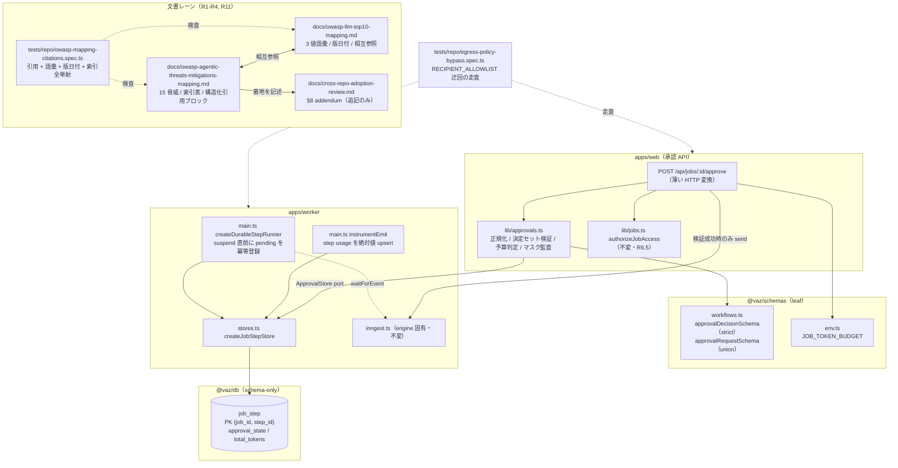

# 007-cross-repo-adoption-closeout — Technical Plan

承認済み要件（WHAT）をアーキテクチャ（HOW）へ翻訳する。実装コードは書かない。
散文は日本語、識別子・型・パス・コードは英語。
調査記録は [`research.md`](research.md)（ADR-1〜ADR-10）、ギャップ実測は
[`gap-analysis.md`](gap-analysis.md)。

## Summary

本 spec は性質の異なる 2 つの塊を扱う。**文書側（R1〜R4・R11）**は既存 2 文書の拡張であり、
引用を「構造化引用ブロック」へ統一することで R1（15 脅威全件）・R2（3 値語彙 ＋ 再評価トリガ）・
R3（リネーム ＋ 版日付）を 1 つの形式の上に載せ、その形式を 1 本の `tests/repo/` ガードで守る
（ADR-8）。**承認経路側（R5〜R10）**は、pending set が durable engine の中にしか無く web から
読めないという単一の構造的障害に支配される（`research.md` I-1）。これを **`job_step`
テーブル 1 枚**（PK `(job_id, step_id)`）へミラーし、承認 API を fire-and-forget から
「1 トランザクションで検証＋消費 → 送信」へ転換することで、D2（consume-once ＋ 存在秘匿）・
D3（境界を跨ぐ usage 予算）・D5（決定セットの原子性）が**同じ 1 つの状態と 1 つの
トランザクションから導かれる**（ADR-1 / ADR-5）。D1・D4・D6 は新しい状態を必要とせず、
既存シーム（`z.strictObject` / `audit-hook.ts` の fail-soft 形 / `tests/repo/` ガード）へ合流する。

着地は 3 つの独立した塊に分かれ、この順で進む: **(0) 先行ブロッカー**（`repo` ガードが
着手前から赤、ADR-3）→ **(1) 文書 4 項目**（R1〜R4、承認経路に依存しない）→
**(2) 承認経路 6 防御**（R5〜R10）→ **(3) 正本への §8 追記**（R11、(1)(2) の結果を記述するため最後）。

## Architecture Overview



**制御フローの要点**:

1. **pending set の真実は `job_step`**。worker が suspend する瞬間に
   `(jobId, stepId, approval_state='pending')` を `onConflictDoNothing` で書く。
   Inngest の関数本体再実行では既存行があるため no-op で、**consume 済みを pending へ戻さない**
   （`research.md` I-2 / ADR-5）。
2. **累積 usage も同じ表**。step 完了時に `(jobId, stepId, total_tokens=<絶対値>)` を upsert する。
   increment ではないので再実行で二重計上しない（I-3）。
3. **承認 API は 1 トランザクションで「`sum(total_tokens)` 読み出し ＋ pending → consumed の
   条件付き UPDATE」**を行い、影響行数が決定数と一致したときだけ `engine.send` する。
   追加 DB ラウンドトリップは **1 回**（NFR「2 回以内」を満たす）。
4. **`engine.send` は `id: "<jobId>:<stepId>"` で冪等化**する（`submitJob` と対称にする）。
   DB が single source of truth、送信は at-least-once。

## Components

### C-1 `AgenticThreatMapping`（`docs/owasp-agentic-threats-mitigations-mapping.md`）

- **Responsibility**: OWASP *Agentic AI – Threats and Mitigations*（15 脅威）の各脅威に対する
  本ハブの対応状況を 1 脅威 1 節で記述する、リネーム後の Agentic 側対応表。
- **Public interface**: 文書構造そのものが契約（C-4 がパースする）。
  ①冒頭の語彙定義ブロック（3 値の意味 ＋ 再評価トリガの義務）、②出所タクソノミ名 ＋
  バージョン日付（`2025-02-17`、ISO-8601）、③**脅威索引表**（脅威名 → 節見出し、15 行）、
  ④各節末の構造化引用ブロック（ADR-8 の 5 キー）、⑤`docs/owasp-llm-top10-mapping.md` への相互参照。
- **Owns**: 15 脅威の該当性判定・状態トークン・再評価トリガ・引用。
  supervisor → specialist 間で何を保証し何を保証しないかの記述（R1.3）。
- **Does NOT own**: LLM01〜LLM10 の単発プロンプト／出力／サプライチェーン脅威（C-2 が持つ）。
  `T<n>` 番号の権威（一次 PDF が持つ。ADR-2 により補助列）。実装の変更（文書は実装を引用するだけ）。
- **Requirements**: 1.1, 1.2, 1.3, 1.4, 1.5, 1.6, 2.1, 2.2, 2.3, 2.4, 2.5, 2.6, 3.1, 3.2, 3.3, 3.5

### C-2 `LlmThreatMapping`（`docs/owasp-llm-top10-mapping.md`）

- **Responsibility**: OWASP Top 10 for LLM Applications 2025（LLM01〜LLM10）の対応表を
  3 値語彙・版日付・構造化引用ブロックへ移行する。
- **Public interface**: C-1 と**同一の文書構造契約**（同じ 5 キー、同じ語彙定義ブロック、
  同じ版日付形式）。C-4 は 2 文書を同じパーサで扱う。
- **Owns**: LLM01〜LLM10 のクレーム・状態トークン・再評価トリガ・引用。
  版日付 `2024-11-17`（OWASP Top 10 for LLM Applications 2025）。
- **Does NOT own**: 脅威索引表（15 脅威の全単射は C-1 固有。LLM 側は LLM01〜LLM10 が
  見出しに ID を持つため索引を必要としない）。エージェント特有脅威（C-1）。
- **Requirements**: 2.1, 2.2, 2.3, 2.4, 2.5, 2.6, 3.3, 3.4, 3.5

### C-3 `MappingStatusVocabulary`（両文書の冒頭に置く語彙定義。形式上の共有コンポーネント）

- **Responsibility**: 状態トークン 3 値（`Mitigated` / `Partial · accepted` / `Accepted`、
  出所 verbatim）の意味と、受容 2 値に再評価トリガを義務づける規則を、読者が表を読む前に確定させる。
- **Public interface**: 両文書の冒頭に**同一文言**で置かれる定義ブロック。
  C-4 が許容トークン集合の正本としてこのブロックを読むのではなく、**C-4 側に 3 値を定数として
  持つ**（文書を書き換えて語彙を増やす経路を塞ぐため。ガードが文書から語彙を学んではならない）。
- **Owns**: 3 値の表記（全角中黒ではなく `·`、`Partial · accepted` の空白を含む verbatim 表記）。
- **Does NOT own**: 各クレームの状態判定（C-1 / C-2 が個別に決める）。
- **Requirements**: 2.1, 2.5

### C-4 `MappingCitationGuard`（`tests/repo/owasp-mapping-citations.spec.ts`）

- **Responsibility**: 対応表 2 文書の引用・語彙・版日付・索引の腐敗を機械検出する単一の
  リポジトリガード。X-18 / X-19 のドリフトも同じガードが守る。
- **Public interface**: `repo` Vitest プロジェクトのテストファイル 1 本。
  対象 2 文書のパスを定数配列で持ち、その**要素数と各ファイルの実在**を検査本体より前に検査する（R4.7）。
  検査項目:
  1. **非空アサート群**（各検査に先行）: 走査文書数 = 2、抽出した引用数 > 0、
     状態トークン数 > 0、索引行数 = 15。
  2. **ファイルパス引用の実在**（R4.1）: 引用ブロック内でパスと判定した文字列が
     リポジトリ内に実在する。
  3. **シンボル引用の実在**（R4.2）: 同一キー行（`- 実装:` / `- テスト:` の 1 行）が
     挙げたパス群のいずれかのファイル本文に、その行が引用するシンボル名が現れる
     （**行をまたいでパスとシンボルを混同しない**——`- 実装:` のシンボルは `- テスト:` の
     パスでは検査しない）。
  4. **CI ステップ名の実在**（R4.3）: `- CI:` キーの第 1 コードスパンが
     `.github/workflows/*.yml` として実在し、残りのコードスパンが当該ワークフローの
     `name:` 値（`yaml` の `parse` で構造的に取得）として実在する。
  5. **語彙の 3 値検査**（R4.4）: `- 状態:` キーの値が 3 値のいずれか。
  6. **再評価トリガの存在**（R2.3 の機械化）: `- 状態:` が受容 2 値のとき
     同一節に `- 再評価トリガ:` が 1 行以上ある。
  7. **版日付の存在**（R4.5）: 2 文書の冒頭にタクソノミ名 ＋ ISO-8601 日付が 1 つずつある。
  8. **索引の全単射**（R1.6 の機械化）: 索引 15 行が指す節見出しがすべて実在し、
     文書内の脅威節がすべて索引に 1 度だけ現れる。
  9. **状態トークンの単一性**（R2.1 の機械化）: 各脅威／クレームの節が持つ `- 状態:` 行が
     **ちょうど 1 行**であることを検査する（0 行または 2 行以上は失敗）。
- **Owns**: 引用ブロックのパーサ（行頭キーによるパース。散文の正規表現走査はしない）。
  パスとシンボルの判別規則。許容する 3 値の定数。
- **Does NOT own**: リンクの解決（`doc-links.spec.ts` が持つ）。
  兄弟リポジトリのパス（コードスパンで書かれ、到達できない）。
  引用が**正しい**かの判断（実在のみを検査する。主張の妥当性は人間のレビュー）。
  新規 GitHub Actions ワークフロー（R4.8 により作らない）。
- **Requirements**: 1.6, 2.1, 2.3, 4.1, 4.2, 4.3, 4.4, 4.5, 4.6, 4.7, 4.8

### C-5 `CrossRepoReferenceGuard`（`tests/repo/cross-repo-reference-resolution.spec.ts` の精密化）

- **Responsibility**: 「repo 修飾形の参照が現ハブ名を名乗る」検査から、相対パス断片
  （`.` / `..`）をリポジトリ名として捕捉する偽陽性を除去する（ADR-3）。
- **Public interface**: 既存 4 テストの意図・アサーション文言は不変。`QUALIFIED_FORM` が
  捕捉した候補名のうち相対パス断片を stale 判定の対象外にする 1 点のみを変える。
- **Owns**: 「repo 修飾形とは何か」の定義。
- **Does NOT own**: コードスパン内の言及（`stripCode` 不在という第 2 の偽陽性クラスは
  ADR-3 で**塞がない**。`research.md` の既知の限界として残す）。
- **Requirements**: 11.6（先行ブロッカー。他のすべての文書作業がこのガードの下で走る）

### C-6 `EgressPolicyBypassGuard`（`tests/repo/egress-policy-bypass.spec.ts`）

- **Responsibility**: `RECIPIENT_ALLOWLIST` を経由せずに宛先を決定するリテラル、および
  許可リスト判定を無効化する記述の混入を、アプリ／パッケージのソース走査で検出する（D6）。
- **Public interface**: `repo` Vitest プロジェクトのテストファイル 1 本。
  走査範囲 `apps/*/src/**` ＋ `packages/*/src/**`（1 回のツリー走査、NFR「実行コスト」）。
  検出対象は 3 クラス: ①メールアドレス形リテラル、②許可リスト判定の短絡
  （`isAllowedRecipient` / `assertAllowedRecipient` の呼び出しを伴わない宛先決定、
  および許可リストを非空リテラルで上書きする記述）、**③承認経路の監査発火点の唯一性**
  （`apps/web/src/app/api/jobs/**` ＋ `apps/web/src/lib/**` のうち `deps.audit` を呼ぶ
  ファイルが `apps/web/src/lib/approvals.ts` の 1 本だけであること。R8.2 の
  「発火点が 1 つであることをテストで固定する」＝ principle 5 の逸脱を承認した
  緩和策の機械化であり、同じ 1 回のツリー走査に相乗りする）。
  ドックコメントに出所（`pydantic-ai-sandbox` の対応テストを**コードスパン**で）と
  `CVE-2026-46678` を明記する（R10.4）。
- **Owns**: 許容例外パスの列挙（許可リスト定義そのもの＝`packages/tools/src/allowlist.ts` 等）。
  その列挙が**空でないこと**と**各パスが実在すること**の検査（R10.3）。
- **Does NOT own**: `tests/` 配下のフィクスチャ・文書（走査範囲外。R10.3）。
  許可リストの**内容**の是非（空初期値の governance は既存の committed 判断）。
  新規 GitHub Actions ワークフロー（R10.5）。
- **Requirements**: 8.2（監査発火点の唯一性）, 10.1, 10.2, 10.3, 10.4, 10.5

### C-7 `ApprovalWireContract`（`packages/schemas/src/workflows.ts` への追加）

- **Responsibility**: 承認 API の入口契約を `@vaz/schemas`（leaf）へ持ち上げ、
  履歴・usage・model を**フィールドとして定義しない**ことと余剰フィールドの拒否を
  型で固定する（D1、ADR-9）。
- **Public interface**:
  - `approvalDecisionSchema` = `z.strictObject({ toolCallId: z.uuid(), decision: z.enum(["approve","reject"]), args: z.unknown().optional() })`
  - `approvalDecisionSetSchema` = `z.strictObject({ decisions: z.array(approvalDecisionSchema).min(1) })`
  - `approvalRequestSchema` = `z.union([approvalDecisionSchema, approvalDecisionSetSchema])`
  - 対応する `type ApprovalDecision` / `ApprovalRequest`（`z.infer`、`any` 不使用）
- **Owns**: 承認リクエストのワイヤ形。単一形とセット形の判別可能 union。
- **Does NOT own**: 決定の**意味**（`ApprovalSignal` への変換は C-8）。承認対象の存在判定（C-9）。
  `ApprovalSignal` / `ApprovalGate`（`apps/worker/src/main.ts` が持つ engine 側の型。移動しない）。
- **Requirements**: 5.1, 5.2, 9.1, 9.3, 9.4

### C-8 `ApprovalDecisionLogic`（`apps/web/src/lib/approvals.ts`）

- **Responsibility**: 承認決定の正規化・決定セット検証・予算判定・マスク済み監査を、
  HTTP から切り離した純関数 ＋ 注入 port として提供する（ADR-10）。
- **Public interface**（すべて `apps/web/src/lib/` 内。`any` 不使用）:
  - `normalizeApprovalRequest(request: ApprovalRequest): { decisions: ApprovalDecision[]; submittedAs: "single" | "set" }`
    — 単一形を 1 要素のセットへ畳み、**投稿された形を保持**する（応答コード選択に使う）。
  - `findDuplicateTarget(decisions): string | null` — セット内重複の検出（R9.3）。
  - `maskedArgKeys(args: unknown): string[]` — 上書きされた**キー名のみ**を返す（値を返さない。R8.1）。
  - `claimApprovalTargets(store, input): Promise<ClaimOutcome>` — 1 トランザクションで
    「累積 usage の読み出し ＋ pending → consumed の条件付き UPDATE」を行う。
    `ClaimOutcome` は `{ kind: "claimed"; cumulativeTokens: number }` /
    `{ kind: "not-claimable" }`（unknown / in-flight / consumed を**区別しない単一の値**）の判別可能 union。
  - `recordApprovalDecisions(deps, entry): Promise<void>` — **承認経路の単一の監査発火点**。
    内部で try/catch し、失敗時は `logger.error` に相関フィールドのみを出す（R8.2〜8.4、ADR-7）。
  - `resolveJobTokenBudget(env): number` — `JOB_TOKEN_BUDGET` の解決（C-10 経由）。
- **Owns**: 存在秘匿の**単一の応答生成点**（unknown / in-flight / consumed が同一の
  `Response` を共有することを構造的に保証する）。マスク規則。予算比較。
  承認決定の監査エントリ形（`tool: "approval:decision"`、`args: { stepId, decision, editedArgKeys }`）。
- **Does NOT own**: ジョブ単位の認可（`lib/jobs.ts` の `authorizeJobAccess` は不変。R6.5）。
  engine への送信（C-11 が行う）。`job_step` の SQL（C-9 が持つ）。
  ツール実行の監査（`packages/agents/src/audit-hook.ts` の fail-loud 経路は不変。R8.5）。
- **Requirements**: 5.2, 5.5, 6.1, 6.2, 6.3, 6.4, 7.2, 7.3, 7.6, 8.1, 8.2, 8.3, 8.4, 8.6, 9.2, 9.3, 9.5, 9.6

### C-9 `JobStepStore`（`packages/db/src/schema.ts` の `jobStep` ＋ `apps/worker/src/stores.ts` の `createJobStepStore`）

- **Responsibility**: 承認対象の pending / consumed 状態と、step ごとに観測した総トークン数を
  Postgres に永続化し、web と worker の双方から port として読み書きできるようにする（ADR-5）。
- **Public interface**（port。`apps/worker/src/stores.ts` から export、`apps/web` は
  `lib/jobs.ts` / `lib/audit.ts` と同じ作法で再利用する）:
  - `registerPending(input: { jobId: string; stepId: string }): Promise<void>`
    — `onConflictDoNothing`。**consume 済みを pending へ戻さない**（I-2）。
  - `recordStepUsage(input: { jobId: string; stepId: string; totalTokens: number }): Promise<void>`
    — `(jobId, stepId)` をキーに `total_tokens` の**絶対値**を upsert（increment しない。I-3）。
  - `claimPending(input: { jobId: string; stepIds: readonly string[]; at: Date }): Promise<{ claimed: number; cumulativeTokens: number }>`
    — 1 トランザクション。`sum(total_tokens)` を読み、`approval_state = 'pending'` の行のみを
    `'consumed'` へ UPDATE し、影響行数を返す。
- **Owns**: `job_step` テーブルの DDL（`packages/db/src/schema.ts`）と
  migration（`packages/db/drizzle/0002_add_job_step.sql`）、drizzle-zod 契約、
  「状態を pending へ戻す UPDATE を提供しない」という API 上の制約。
- **Does NOT own**: `pg` pool（composition root が持つ。`packages/db` は schema-only）。
  いつ pending を登録するかの判断（C-11 が持つ）。予算の閾値（C-10）。
  `job_event` の公開契約（`jobEventTypeEnum` に値を足さない。R7.5 / ADR-5）。
- **Requirements**: 6.1, 6.6, 7.1, 9.2, 9.6

### C-10 `JobTokenBudgetEnv`（`packages/schemas/src/env.ts` への追加）

- **Responsibility**: ジョブ単位の累積トークン予算を env から解決し、既定値を持たせる。
- **Public interface**: `aiEnvSchema` に
  `JOB_TOKEN_BUDGET: z.coerce.number().int().positive().default(<既定値>)` を追加し、
  `parseAiEnv` の受け渡しに `emptyToUndefined(env.JOB_TOKEN_BUDGET)` を足す
  （既存 `CHAT_TOKEN_BUDGET` と完全に同型）。
- **Owns**: 予算の既定値と検証（未設定環境で既存ジョブが失敗しない）。
- **Does NOT own**: 予算の**適用**（C-8 が比較する）。usage の観測（C-9 / C-11）。
  `CHAT_TOKEN_BUDGET`（chat 経路の予算。意味が違うので共有しない）。
- **Requirements**: 7.4

### C-11 `WorkerApprovalMirror`（`apps/worker/src/main.ts` の拡張）

- **Responsibility**: engine の中にしか無い pending set と observed usage を、
  ADR-2（Inngest import は `inngest.ts` のみ）を破らずに `job_step` へミラーする。
- **Public interface**:
  - `CreateDurableStepRunnerOptions` / `RunJobOptions` に **optional な `jobStepStore?: JobStepStore`**
    を追加（省略時は no-op。既存の Phase 1/2 呼び出しとテストは無改変で動く。
    `jobStore?` が既に採っている作法と同型）。
  - `createDurableStepRunner.run` — `requiresApproval` が真の step について、
    **`approvalGate` を await する直前**に `registerPending` を呼ぶ。
    `engineStep.run` で包まない（既存の「step をネストしない」制約を守る）。
- **不変条件 INV-1（登録は承認到着より先）**: `registerPending` は `approvalGate` の
  `await` より前、かつ同一の同期経路で呼ぶ（間に別の `await` を挟まない）。
  この順序が承認経路の正しさの前提である——`step-start` の publish は
  [`packages/agents/src/supervisor.ts`](../../packages/agents/src/supervisor.ts) が
  `step.run()` の**前**に行うため、UI が承認を提示できる瞬間に pending 行がまだ無い窓が
  構造的に存在する。窓を 0 にはできない（publish は `packages/agents`、登録は
  `apps/worker` の別レイヤにある）ため、**残余リスクとして受容**し
  Error Handling 表に 1 行として記録する（実害確率は人間の操作遅延 ≫ 窓幅）。
  検証はテスト表の「`registerPending` が suspend 直前に 1 度呼ばれる」を
  **gate の await より前であることの順序アサート**として書く。
  - `instrumentEmit` — `completion` イベントが `result` を伴い、その `result` が `usage` を持つとき
    `recordStepUsage` を呼ぶ。読む値は `specialistResult.usage`（サーバ観測値。R7.6）。
- **Owns**: 「いつ pending になるか」「いつ usage が確定するか」の判断。
  Inngest 関数本体再実行に対する冪等性の担保（呼ぶ port が冪等であることに依拠し、
  ここに条件分岐を持ち込まない）。
- **Does NOT own**: `submitApproval` の呼び出し側の検証（C-8 / C-12）。
  engine 固有 API（`apps/worker/src/inngest.ts` のみ）。
  どの step が承認を要するかの決定（`requiresApprovalForKind` は本 spec の out of scope）。
- **Requirements**: 6.1, 6.6, 7.1, 7.6

### C-12 `ApprovalRoute`（`apps/web/src/app/api/jobs/[id]/approve/route.ts`）

- **Responsibility**: HTTP ⇔ C-8 の薄いアダプタ。ドックコメントで
  「fire-and-forget から検証してから送るへの転換」を明示的に記録する（ADR-1 / 論点 E）。
- **Public interface**: `POST`。応答は
  400（JSON 不正 / スキーマ不適合＝余剰フィールド含む）/ 401 / 403 / 404（ジョブ単位、既存）/
  **404（承認対象単位、新規・無情報）**/ **409（決定セット、新規・無情報）**/
  **429（予算超過、新規）**/ 500 / 202（成功、既存）。
- **Owns**: ステータスコードの選択（`submittedAs` が `"single"` なら 404、`"set"` なら 409）。
  `engine.send` の呼び出しと `id: "<jobId>:<stepId>"` による冪等化。
- **Does NOT own**: 検証ロジック（C-8。カバレッジ対象の `lib/` に置く。ADR-10）。
  認可ラダー（`authorizeJobAccess`。R6.5 により不変）。
- **Requirements**: 5.2, 5.3, 5.4, 5.5, 6.2, 6.3, 6.4, 6.5, 7.2, 7.3, 9.1, 9.4, 9.5

### C-13 `CanonicalReviewAddendum`（`docs/cross-repo-adoption-review.md` §8 ＋ 参照の是正）

- **Responsibility**: 本 spec の着地を日付付き §8 addendum として正本へ**追記**し、
  リネームに伴うリンク先の是正を「本文の改変ではない」ものとして記録する（R11、ADR-4）。
- **Public interface**: §8 の見出し（`## §8 追記（YYYY-MM-DD）— …`）と、
  X-17 / X-18 / X-19 / X-20 ＋ D1〜D6 の着地・非着地の一覧（非着地には理由）。
  適用面の限定（`apps/web` の job/approval 経路のみ、`/api/chat` と `services/api` は対象外）。
- **Owns**: 着地の記述。リンク先是正の記録。`docs/cross-repo-adoption-backlog.md` §5 の
  X-17〜X-20 を「起票」から「解決」へ更新すること。
- **Does NOT own**: §1〜§7 の主張・測定値・判定（**改変しない**。R11.1）。
  `specs/review/2026-09-22-cross-repo-verification.md` の主張（リンク先のみ是正。ADR-4）。
- **Requirements**: 11.1, 11.2, 11.3, 11.4, 11.5, 11.6, 11.7

### C-14 `TraceabilityRecord`（`specs/007-cross-repo-adoption-closeout/traceability.md`）

- **Responsibility**: 各受け入れ基準 ID と実装・テストの対応を git 追跡対象として残す（R12.7、
  憲章 principle 10「どの指摘がどこで閉じたか」）。
- **Public interface**: AC ID → 実装ファイル → 検証テスト（＋非空虚性確認の有無）の表。
- **Owns**: 対応関係の記録。本 plan が訂正した spec の 2 点（`research.md` の未解決 ❓ 2 件）の追記。
- **Does NOT own**: 要件そのもの（`spec.md`）。設計判断（本文書 / `research.md`）。
- **Requirements**: 12.4, 12.7

## Data Model

新規の永続エンティティは **`job_step` の 1 枚のみ**（ADR-5）。既存 6 テーブルは無改変
（`job_event` の pg enum に値を足さないことが R7.5 の後方互換方針の要）。

```mermaid
erDiagram
  JOB ||--o{ JOB_STEP : "has per-step state"
  JOB ||--o{ JOB_EVENT : "has progress (unchanged)"
  JOB ||--o{ AUDIT_LOG : "has audit rows (reused)"

  JOB {
    uuid id PK
    text user_id
    job_status status
    text workflow
    timestamptz created_at
  }
  JOB_STEP {
    uuid job_id PK_FK
    uuid step_id PK
    approval_state approval_state "NULL = 承認対象でない step"
    timestamptz consumed_at
    integer total_tokens "観測値の絶対値。increment しない"
    timestamptz created_at
  }
  AUDIT_LOG {
    uuid id PK
    uuid job_id FK
    text user_id
    text tool "approval:decision を追加（ADR-7）"
    jsonb args "editedArgKeys のみ。値は載せない"
    timestamptz ts
  }
```

| Entity | Field | Type | Notes |
|--------|-------|------|-------|
| `job_step` | `job_id` | `uuid` NOT NULL | `job.id` FK、`ON DELETE CASCADE`（`job_event` と同じ扱い。step 状態はジョブに従属する） |
| `job_step` | `step_id` | `uuid` NOT NULL | `SupervisorPlan` の `stepId`。`(job_id, step_id)` が複合 PK — consume-once の一意性をここで担保する |
| `job_step` | `approval_state` | `approval_state` pg enum NULL | 値は `pending` / `consumed` の 2 値。**NULL は「承認を要しない step」**。`consumed` → `pending` へ戻す UPDATE は port が提供しない（C-9） |
| `job_step` | `consumed_at` | `timestamptz` NULL | `claimPending` が `deps.now()` 由来の値で埋める（ADR-3 準拠。`now()` を SQL 側で呼ばない＝テストで時刻を固定できる） |
| `job_step` | `total_tokens` | `integer` NOT NULL DEFAULT `0` | その step で**サーバが観測した**総トークン数（`specialistResult.usage.totalTokens`）。ジョブの累積は `sum` で求める |
| `job_step` | `created_at` | `timestamptz` NOT NULL DEFAULT `now()` | 既存 5 テーブルと同じ規約 |
| `approval_state` | — | pg enum | `('pending','consumed')`。`jobStatusEnum` / `jobEventTypeEnum` と同じ定義作法。**`jobEventTypeSchema` のようなロックステップ対象ではない**（SSE 公開契約に出さない） |
| `audit_log` | `tool` | `text` NOT NULL | 既存列。承認決定は `"approval:decision"` という名前空間付きの値を使い、既存のツール名と衝突させない（ADR-7） |
| `audit_log` | `args` | `jsonb` NULL | 既存列。承認決定では `{ stepId, decision, editedArgKeys: string[] }` のみ。**編集値そのものは入れない**（R8.1） |

**インデックス**: 複合 PK `(job_id, step_id)` が `sum(total_tokens) WHERE job_id = $1` と
`UPDATE … WHERE job_id = $1 AND step_id = ANY($2)` の双方を賄うため、追加インデックスは置かない
（`job_event_job_id_ts_idx` のような明示インデックスは不要）。

**マイグレーション**: `packages/db/drizzle/0002_add_job_step.sql`（手書き SQL、lexical order で
冪等適用、`mise run db:migrate`）。drizzle-kit は不採用の方針を維持する。
`packages/db/tests/schema-ddl.spec.ts` のドリフトテストは import 一覧に `jobStep` /
`approvalStateEnum` を足すだけで新テーブルを自動的に検査対象にする。

## Interfaces / Contracts

### IF-1 `POST /api/jobs/:id/approve`（ワイヤ契約の変更）

**リクエスト**（C-7、`z.union`。単一形とセット形のいずれか。**余剰フィールドは拒否**）:

```
単一形（既存・ApprovalPanel.tsx が送る形。R9.4 により維持）
  { toolCallId: uuid, decision: "approve" | "reject", args?: unknown }

セット形（新規。R9.1）
  { decisions: [ { toolCallId, decision, args? }, … ] }   // 1 件以上
```

**レスポンス**:

| Status | Body | 条件 | 要件 |
|---|---|---|---|
| 202 | `{ ok: true }` | 全対象を消費し `engine.send` 済み（既存と同一） | 9.4 |
| 400 | `{ error: "Request body must be valid JSON" }` | JSON 不正（既存） | — |
| 400 | `{ error: "Invalid approval request" }` | スキーマ不適合。**未定義フィールドを 1 つでも含む場合を含む**（`z.strictObject`） | 5.2, 5.3 |
| 401 / 403 / 404 | 既存の `authorizeJobAccess` 応答 | ジョブ単位の認可ラダー（**不変**） | 6.5 |
| **404** | `{ error: "Not found" }` — **単一の定数。識別子・状態語を含まない** | 承認対象が unknown / in-flight / consumed のいずれか（**3 ケースで完全に同一**）。単一形で投稿されたとき | 6.2, 6.3, 6.4 |
| **409** | `{ error: "Conflict" }` — **無情報。どの対象が不正かを列挙しない** | 決定セットに pending でない対象または重複が含まれる。セット形で投稿されたとき | 9.2, 9.3, 9.5 |
| **429** | `{ error: "Token budget exhausted" }` | 累積 usage が `JOB_TOKEN_BUDGET` 以上。**対象は消費済みにする** | 7.2, 7.3 |
| 500 | `{ error: "Failed to submit approval" }` | engine 送信失敗（既存） | — |

**存在秘匿の構造的保証**（R6.4）: 404 / 409 の `Response` は C-8 が持つ**1 つの生成関数**から
返す。ヘッダ・ボディ・コードのいずれにも分岐を作らないため、3 ケースの区別は
呼び出し側で表現できない。

**ステータス選択規則**: `normalizeApprovalRequest` が返す `submittedAs` で決める
（`"single"` → 404 / `"set"` → 409）。R6.2 は承認対象単位の 404 を、R9.2 はセットの 409 を
それぞれ要求しており、投稿形で分岐するのが両方を満たす唯一の読み方である。
**この読み方は R6.2 の文言をそのままには満たさない**（セット形で consumed な対象を送ると
409 が返る）。R6.2 の実質的な要求は**ケース間の区別不能性**（R6.4）であり、ステータス値の
固定ではないと読む——下の「spec に対する訂正」3 点目として明記する。

### IF-2 `JobStepStore` port（C-9）

```
registerPending({ jobId, stepId }): Promise<void>
  INSERT … ON CONFLICT (job_id, step_id) DO NOTHING
  → 再実行安全。consumed を pending へ戻さない。

recordStepUsage({ jobId, stepId, totalTokens }): Promise<void>
  INSERT … ON CONFLICT (job_id, step_id) DO UPDATE SET total_tokens = EXCLUDED.total_tokens
  → 絶対値の upsert。approval_state は触らない。

claimPending(jobId, stepIds, at): Promise<{ rowCount: number; totalTokens: number }>
  （as-built: 位置引数 3 つ。フィールド名は port 実装 `apps/worker/src/stores.ts` に合わせて
   claimed → rowCount, cumulativeTokens → totalTokens。意味は変わらない）
  1 トランザクション:
    totalTokens ← SELECT COALESCE(sum(total_tokens),0) WHERE job_id = $1
    rowCount    ← UPDATE … SET approval_state='consumed', consumed_at=$at
                    WHERE job_id=$1 AND step_id = ANY($2) AND approval_state='pending'
                    の影響行数
  → rowCount === stepIds.length のときだけ「消費成功」。
    それ以外は例外を投げてトランザクション全体をロールバックし（`ClaimMismatchError` を
    `claimPending` 内で捕捉）、実際の不一致した rowCount を返す（R9.2 / R9.6
    「いずれも消費しない」）。呼び出し側（`claimApprovalTargets`）はこれを
    `rowCount !== decisions.length` で再確認する（多層防御）。
```

**adversarial-review fix（2026-09-23 追記）**: `/sdd-validate-impl` の初回検証で、上記の
`stepIds` 引数と原子性チェックが実装から欠落していたことが判明した（`claimPending(jobId,
at)` のみで、ジョブの pending 行を無条件に全件消費していた）。混在セット（pending 1 件 ＋
未登録 1 件など）を送ると、未登録側の存在にかかわらず pending 側だけ消費されて `claimed`
が返り、R9.2 / R9.6 の要求（1 件でも不正なら全体を拒否・無消費）に反していた。上記の
as-built 契約へ修正し、`apps/worker/tests/stores-job-step.spec.ts` /
`apps/web/tests/approvals.spec.ts` に回帰テストを追加、非空虚性を意図的な breakage で確認
済み（`specs/007-cross-repo-adoption-closeout/traceability.md` の REQ-009 (9.2)/(9.6) 参照）。

**原子性の所在**: 「1 件でも不正なら 1 つも消費しない」は**このトランザクションが担保**する。
`engine.send` は消費コミット後に at-least-once で行い、`id: "<jobId>:<stepId>"` で冪等化する。
送信後クラッシュの残余リスクは ADR-6 で受容済み（approval timeout が終端を保証する）。

### IF-3 構造化引用ブロック（C-1 / C-2 の文書契約、C-4 がパースする）

各脅威節の末尾に置く固定キー行。キー名は日本語（既存 `- 実装:` / `- テスト:` を踏襲）。

```
- 状態: Mitigated                      ← 3 値のいずれか 1 つ（必須・1 行）
- 実装: `path/to/file.ts`（`symbolName`）  ← パスは 1 つ以上。リンク形式も可
- テスト: `path/to/file.spec.ts`（`testSymbol`）
- CI: `.github/workflows/lint.yml` — `Model-ID gate`   ← 任意・0 行以上
- 再評価トリガ: <具体的な将来の変更>     ← 状態が Mitigated 以外なら 1 行以上（必須）
```

- **パス / シンボルの判別**: `/` を含み既知の拡張子（`.ts` / `.tsx` / `.py` / `.sql` / `.yml` /
  `.yaml` / `.md` / `.json` / `.sh` / `.scss`）で終わる、またはディレクトリ形（末尾 `/`）なら**パス**。
  それ以外のコードスパンは**シンボル**として、**同一キー行**（`- 実装:` / `- テスト:` の
  1 行）が挙げたパス群のいずれかの本文に実在することを検査する（キーをまたいで検査しない）。
- **`- CI:` の形**: 第 1 コードスパン＝ワークフローファイル（実在必須）、
  以降のコードスパン＝そのワークフローの `name:` 値（`yaml` の `parse` で構造的に取得）。
  これによりステップ名とシェルコマンドの混在（`pnpm audit --audit-level=moderate`）が
  構造的に解消する——コマンドは散文へ移す。
- **旧 `- 未対応:` キーは廃止**し、`- 状態:` ＋ `- 再評価トリガ:` へ吸収する（R2.2）。
- **再評価トリガの書き方**（R2.4）: 具体的な将来の変更のみ。
  「定期的に」「次回レビューで」のような時間基準は**書かない**（ガードは文面の具体性を
  判定しないため、これはレビュー規約として文書冒頭に明記する）。

### IF-4 脅威索引表（C-1 のみ、R1.6）

```
| T-ID | 脅威（出所 verbatim） | 本文書の節 |
|---|---|---|
| T<n> | Memory Poisoning | メモリ/RAG レイヤ — Memory Poisoning |
…（15 行）
```

- **主キーは「脅威」列**（ADR-2）。ガードは 15 行・節見出しの実在・全単射を検査する。
- **`T-ID` 列は一次 PDF から実測して埋める補助列**で、ガードの判定には使わない。
  取得できない場合は列を置かず、その事実を文書冒頭に実測として明記する（憲章 principle 8）。

### IF-5 env（C-10）

```
JOB_TOKEN_BUDGET : 正の整数、既定値あり（未設定環境で既存ジョブが失敗しない。R7.4）
```

`CHAT_TOKEN_BUDGET` とは**別の変数**（chat の 1 ラン予算 ≠ ジョブの累積予算）。
`.env.example` の環境変数一覧に同型で追加する（`CHAT_TOKEN_BUDGET` と同じく `docker-compose.yml` には置かない——実測での既存作法）。

## File Structure Plan

<!-- すべてのタスク `_Boundary:_` はこの表の行のみを対象にできる。 -->

### 塊 0 — 先行ブロッカー（ADR-3）

| File | Create/Modify | Responsibility |
|------|---------------|----------------|
| [`tests/repo/cross-repo-reference-resolution.spec.ts`](../../tests/repo/cross-repo-reference-resolution.spec.ts) | Modify | `QUALIFIED_FORM` が捕捉した候補名から相対パス断片（`.` / `..`）を stale 判定の対象外にし、着手前から赤の偽陽性を閉じる |

### 塊 1 — 文書 4 項目（R1〜R4）

| File | Create/Modify | Responsibility |
|------|---------------|----------------|
| `docs/owasp-agentic-threats-mitigations-mapping.md` | Create（旧ファイルからの `git mv` ＋ 全面改訂） | 15 脅威全件の節・脅威索引表・3 値語彙・再評価トリガ・版日付・構造化引用ブロックを持つ Agentic 側対応表 |
| `docs/owasp-agentic-ai-top10-mapping.md` | Delete（`git mv` の結果） | 旧ファイル名。内容（レイヤ別 15 脅威）に合わせて改名されるため残さない |
| [`docs/owasp-llm-top10-mapping.md`](../../docs/owasp-llm-top10-mapping.md) | Modify | 3 値語彙・再評価トリガ・版日付（`2024-11-17`）・構造化引用ブロックへ移行し、相互参照を新ファイル名へ更新。「全 6 ワークフロー」の実測是正（7 本）を含む |
| `tests/repo/owasp-mapping-citations.spec.ts` | Create | 2 文書の引用（パス / シンボル / CI ステップ名）・状態語彙 3 値・版日付・脅威索引の全単射を検査する単一ガード（非空アサート先行） |
| [`CLAUDE.md`](../../CLAUDE.md) | Modify | 冒頭の governance docs 一覧が指す Agentic 側対応表のリンクを新ファイル名へ更新（実測 1 箇所、7 行目） |

### 塊 2 — 承認経路 6 防御（R5〜R10）

| File | Create/Modify | Responsibility |
|------|---------------|----------------|
| [`packages/schemas/src/workflows.ts`](../../packages/schemas/src/workflows.ts) | Modify | `approvalDecisionSchema`（`z.strictObject`）/ `approvalDecisionSetSchema` / `approvalRequestSchema`（union）と派生型を追加（D1・D5 の入口契約） |
| [`packages/schemas/src/env.ts`](../../packages/schemas/src/env.ts) | Modify | `JOB_TOKEN_BUDGET` を `aiEnvSchema` と `parseAiEnv` に追加（`CHAT_TOKEN_BUDGET` と同型） |
| [`packages/db/src/schema.ts`](../../packages/db/src/schema.ts) | Modify | `approvalStateEnum` と `jobStep` テーブル（PK `(job_id, step_id)`）＋ drizzle-zod 契約を追加 |
| `packages/db/drizzle/0002_add_job_step.sql` | Create | `approval_state` enum と `job_step` テーブルの手書き DDL（lexical order で冪等適用） |
| [`packages/db/tests/schema-ddl.spec.ts`](../../packages/db/tests/schema-ddl.spec.ts) | Modify | import 一覧に `jobStep` / `approvalStateEnum` を追加し、新テーブルをドリフト検査の対象に含める |
| [`apps/worker/src/stores.ts`](../../apps/worker/src/stores.ts) | Modify | `JobStepStore` port と Drizzle 実装 `createJobStepStore`（`registerPending` / `recordStepUsage` / `claimPending`）を追加 |
| [`apps/worker/src/main.ts`](../../apps/worker/src/main.ts) | Modify | optional `jobStepStore?` を `CreateDurableStepRunnerOptions` / `RunJobOptions` に追加し、suspend 直前に `registerPending`、`instrumentEmit` の `completion` で `recordStepUsage` を呼ぶ |
| [`apps/worker/src/start.ts`](../../apps/worker/src/start.ts) | Modify | composition root で `createJobStepStore` を構築し `registerWorker` へ注入する |
| `apps/web/src/lib/approvals.ts` | Create | 決定セットの正規化・重複検出・消費（`claimPending` 呼び出し）・予算判定・存在秘匿レスポンスの単一生成点・マスク済み監査の単一 fail-soft 発火点 |
| [`apps/web/src/app/api/jobs/[id]/approve/route.ts`](../../apps/web/src/app/api/jobs/%5Bid%5D/approve/route.ts) | Modify | 「検証してから送る」への転換。`lib/approvals.ts` を呼び、404 / 409 / 429 を返し、成功時のみ `engine.send`（`id` 付き）。ドックコメントに方針転換を記録 |
| [`apps/worker/src/main.ts`](../../apps/worker/src/main.ts)（`submitApproval`） | Modify | `engine.send` に `id: "<jobId>:<stepId>"` を渡し、`submitJob` と対称な冪等化を与える（上の行と同一ファイル） |
| `tests/repo/egress-policy-bypass.spec.ts` | Create | `apps/*/src/**` ＋ `packages/*/src/**` を 1 回走査し、宛先リテラルと許可リスト判定の短絡を検出（例外列挙 ＋ その実在検査 ＋ 非空アサート ＋ 出所・CVE のドックコメント） |
| [`.env.example`](../../.env.example) | Modify | `JOB_TOKEN_BUDGET` を既定値つきで追記（実測: `CHAT_TOKEN_BUDGET` も `.env.example` のみに置かれ `docker-compose.yml` には無い。同じ作法に揃える） |

### 塊 2 — テスト（TDD。実装より先に書く。憲章 principle 9）

| File | Create/Modify | Responsibility |
|------|---------------|----------------|
| [`apps/web/tests/jobs-approve-route.spec.ts`](../../apps/web/tests/jobs-approve-route.spec.ts) | Modify | 既存 10 テスト（R9.4 の回帰ガード）を維持したまま、余剰フィールドの 400・3 ケース同一 404・決定セットの 409・予算超過 429・成功時のみ送信を追加。engine / store / authz を全モック（ネットワーク非依存、R12.5） |
| `apps/web/tests/approvals.spec.ts` | Create | `lib/approvals.ts` の純関数（正規化 / 重複検出 / `maskedArgKeys` / 予算判定 / 監査の fail-soft）の単体テスト。監査シンクを失敗させても再開が成功することを固定（R8.3） |
| [`apps/worker/tests/main.spec.ts`](../../apps/worker/tests/main.spec.ts) | Modify | `registerPending` が suspend 直前に 1 度呼ばれること、**同一 stepId で関数本体を再実行しても consumed が pending へ戻らないこと**（I-2 の罠）、`recordStepUsage` が絶対値で呼ばれること |
| `apps/worker/tests/stores-job-step.spec.ts` | Create | `createJobStepStore` の 3 メソッドが期待する SQL 形（`ON CONFLICT DO NOTHING` / 絶対値 upsert / 1 トランザクション claim）で組まれること。Drizzle をフェイクで受ける |
| [`packages/schemas/tests/workflows.spec.ts`](../../packages/schemas/tests/workflows.spec.ts) | Modify | `approvalRequestSchema` が単一形・セット形を受理し、**履歴 / usage / model を名乗るフィールドを含むボディを reject** すること（D1 の「証明」） |
| [`packages/schemas/tests/env.spec.ts`](../../packages/schemas/tests/env.spec.ts) | Modify | `JOB_TOKEN_BUDGET` の既定値・`coerce`・正数制約 |
| [`packages/db/tests/schema.spec.ts`](../../packages/db/tests/schema.spec.ts) | Modify | `jobStep` の列・PK・FK cascade・`approvalStateEnum` の値順を固定 |
| [`apps/web/tests/e2e/approval-resume.spec.ts`](../../apps/web/tests/e2e/approval-resume.spec.ts) | Verify only（周辺。原則無改変） | `submitApproval` / `ApprovalSignal` / `DurableEngine.send` を直接叩く既存 E2E。C-7〜C-12 の署名変更で無言に壊れないことを確認する（AGENTS.md の periphery 前置き規約） |
| [`apps/web/tests/ApprovalPanel.spec.tsx`](../../apps/web/tests/ApprovalPanel.spec.tsx) | Verify only（周辺。原則無改変） | 既存単一形ボディ送信の UI テスト。R9.4（既存呼び出しを壊さない）の回帰ガードとして緑を確認する |
| [`apps/web/tests/jobs.spec.ts`](../../apps/web/tests/jobs.spec.ts) | Verify only（周辺。原則無改変） | ジョブ単位の既存テスト。`authorizeJobAccess` 不変（R6.5）の回帰ガードとして緑を確認する |

### 塊 3 — 正本への追記と記録（R11・R12.7）

| File | Create/Modify | Responsibility |
|------|---------------|----------------|
| `docs/cross-repo-adoption-review.md` | Modify（**追記のみ ＋ §7.6 のリンク先是正**） | 日付付き §8 addendum を末尾に追記（X-17〜X-20 ＋ D1〜D6 の着地／非着地と理由、適用面の限定、リンク先是正の記録）。§1〜§7 の主張・測定値・判定は改変しない |
| [`docs/cross-repo-adoption-backlog.md`](../../docs/cross-repo-adoption-backlog.md) | Modify | §5 の X-17〜X-20 を「起票」から本 spec による解決へ更新（リンク 1 箇所 ＋ コードスパン 1 箇所の新ファイル名反映を含む） |
| [`specs/review/2026-09-22-cross-repo-verification.md`](../review/2026-09-22-cross-repo-verification.md) | Modify（**リンク先のみ**） | 旧ファイル名への相対リンク 1 箇所を新名へ是正。主張・測定値・判定は一切変えない（ADR-4） |
| [`specs/007-cross-repo-adoption-closeout/gap-analysis.md`](gap-analysis.md) | Modify（**リンク先のみ**） | 旧ファイル名への相対リンク 1 箇所を新名へ是正（`doc-links.spec.ts` を緑に保つ） |
| `specs/007-cross-repo-adoption-closeout/traceability.md` | Create | AC ID → 実装 → 検証テスト → 非空虚性確認の対応表（R12.7）。本 plan が訂正した spec の 2 点も記録する |
| [`AGENTS.md`](../../AGENTS.md) | Modify | `tests/repo/` のガード一覧（「Repo-governance guards」）に新規 2 本を追記し、`job_step` テーブルと承認 API の 404/409/429 を「Things that bite」相当の不変条件として記録 |
| [`CLAUDE.md`](../../CLAUDE.md) | Modify | 上と同じ（塊 1 のリンク更新とは別の追記。承認 API が fire-and-forget でなくなった点） |

**この表に無いファイルは触らない。** とくに:
`services/api/**`（verbatim subtree、上流の所有物）/
`apps/web/src/app/api/chat/**`（`/api/chat` は out of scope）/
`apps/web/src/app/api/jobs/[id]/stream/route.ts`（**変更しない**——累積 usage は
既存 optional な `completion.metrics` 以外の形で配信しないため R7.5 の WHERE 節に入らない）/
`apps/worker/src/inngest.ts`（ADR-2。engine 固有 import を増やさない）/
`packages/agents/src/audit-hook.ts`（R8.5。ツール実行監査の方針は不変）/
`packages/agents/src/supervisor.ts`（R1.3 は引用するだけ。承認要否の決定は out of scope）/
`packages/config/src/model-allowlist.ts`（モデル文字列を増やさない。R12.3）/
`.github/workflows/**`（R4.8 / R10.5 / R12.2。新規ワークフローを作らない）

## Error Handling & Edge Cases

### 承認経路

| 条件 | 振る舞い | 要件 |
|---|---|---|
| ボディが JSON として不正 | 400 `{ error: "Request body must be valid JSON" }`。engine に到達しない（既存） | — |
| ボディに未定義フィールドが 1 つでもある（`message_history` / `usage` / `model` を名乗るものを含む） | `z.strictObject` が reject → 400。**承認対象を消費しない**ため正しいボディでの再送が成立する | 5.2, 5.3, 5.5 |
| `args` 内に偽造フィールドを潜らせる | 入口は通るが `mergeApprovedArgs` の `specialistInputSchema.parse` が未知キーを strip する。**例外**: `data-processing.input: z.unknown()` は通す → 対応表で `Partial · accepted` ＋ 再評価トリガとして明記する | 5.3 |
| 承認対象が unknown / 現在 suspend していない / 既に消費済み（単一形） | **3 ケースで完全に同一の** 404 `{ error: "Not found" }`。単一の生成関数から返すためヘッダ・コード・ボディに差が生じない | 6.1, 6.2, 6.3, 6.4 |
| 決定セットに pending でない対象が 1 件でも含まれる | トランザクションをロールバックし 409 `{ error: "Conflict" }`。**いずれの対象も消費しない**。engine に 1 件も送らない | 9.2, 9.5, 9.6 |
| 決定セット内に同一の承認対象が 2 回以上現れる | トランザクション前に検出して 409。DB に触れない | 9.3, 9.6 |
| 累積 usage が `JOB_TOKEN_BUDGET` 以上 | 429。**対象は消費済みのままコミット**する（同一対象の再試行が再開経路を再び開かない） | 7.2, 7.3 |
| `JOB_TOKEN_BUDGET` 未設定 | 既定値が適用され、既存のジョブ実行は失敗しない | 7.4 |
| 消費は成功したが `engine.send` が失敗 | 500。対象は消費済みのまま（再開されない）。Inngest の approval timeout が `ApprovalDeniedError("expired")` として終端させる（ADR-6 の受容） | — |
| 消費コミット後・送信前にプロセスが落ちる | 同上。approval timeout が終端を保証し、無言で吊り下がる経路は無い。**受容した残余リスク**として対応表に記録する | ADR-6 |
| 監査シンクが失敗 | 再開を失敗させない。成功時と**同じステータス**を返す。`logger.error` は相関フィールド（`jobId` / `stepId` / `error.message`）のみで、raw `args` の値・生プロンプトを含まない | 8.3, 8.4 |
| Inngest が関数本体を再実行（リトライ / resume） | `registerPending` は `ON CONFLICT DO NOTHING` のため no-op。**consumed が pending へ戻らない**。`recordStepUsage` は絶対値 upsert のため二重計上しない | 6.1, 6.6, 7.1 |
| `engine.send` が重複（at-least-once） | `id: "<jobId>:<stepId>"` により engine 側で 1 本に畳まれる | 6.1 |
| ジョブ自体が他人のもの / 未存在 / 未認証 | 既存の `authorizeJobAccess` ラダー（400 / 401 / 404 / 403）。**変更しない**。承認対象単位の存在秘匿とは別レイヤ | 6.5 |
| `step-start` の SSE 受信直後、`registerPending`（INV-1）より早く承認が到着 | 存在秘匿により**無情報 404**（unknown と区別できないため、クライアントに再送を促す信号は出ない）。窓は publish → 登録の同一同期経路分のみで、人間の操作遅延 ≫ 窓幅。**受容した残余リスク**として INV-1 に記録する | 6.2, 6.3, INV-1 |
| `jobStepStore` が注入されていない（Phase 1/2 呼び出し・既存テスト） | worker 側は no-op（optional port）。web 側は必須のため composition root で必ず注入する | — |

### 文書・ガード

| 条件 | 振る舞い | 要件 |
|---|---|---|
| 対応表が引用するパスが解決しない | C-4 が失敗し、どのファイルのどの引用かを列挙する | 4.1 |
| 引用されたシンボルが同一ブロックのどのパスにも存在しない | C-4 が失敗する | 4.2 |
| `- CI:` の第 1 コードスパンがワークフローとして実在しない／ステップ名が `name:` に無い | C-4 が失敗する | 4.3 |
| 状態トークンが 3 値以外（旧「対応済み」「未対応」を含む） | C-4 が失敗する。許容 3 値は**ガード側の定数**であり文書から学ばない | 2.1, 2.2, 4.4 |
| 受容 2 値の節に `- 再評価トリガ:` が無い | C-4 が失敗する | 2.3 |
| いずれかの文書から版日付が消える | C-4 が失敗する | 4.5 |
| 索引が 15 行でない／指す節が実在しない／脅威節が索引に無い | C-4 が失敗する（全単射検査） | 1.1, 1.4, 1.6 |
| 対応表 2 文書のいずれかがリポジトリから消える | C-4 は対象パスを定数配列で持ち、**要素数と各ファイルの実在を検査本体より前に**検査するため失敗する | 4.7 |
| 走査対象が 0 件になる（正規表現の書き換え等） | 各検査に先行する非空アサートが失敗する（偽陽性緑を塞ぐ） | 4.6, 10.2 |
| ソースに宛先リテラル／許可リスト判定の短絡が混入 | C-6 が失敗する | 10.1 |
| C-6 の例外列挙が空になる／例外パスが実在しなくなる | C-6 が失敗する（例外リストが陳腐化できない） | 10.3 |
| リネーム後に旧名への相対リンクが残る | `doc-links.spec.ts` が失敗する。実測 7 箇所 / 6 ファイル（`research.md` I-6）をすべて是正する | 3.4, 11.6 |
| `specs/<feature>/` から正本レビューへリンクする | C-5 の精密化により stale 判定されない。規約（本 repo はリンク）を曲げずに緑になる | 11.6 |

## Constitution Compliance

[`specs/memory/constitution.md`](../memory/constitution.md) v1.2.0 の 11 原則 ＋ Additional Constraints を検査した。

| Principle | Status | Notes |
|-----------|--------|-------|
| 1. マルチエージェント化はトークン対価で正当化する | ✅ | 新しいエージェントを追加しない。既存 supervisor → specialist 構成を**文書化する**だけ（R1.3）。3 条件のゲートに触れない |
| 2. 層の責任境界を型で固定する | ✅ | 承認の wire 契約を `@vaz/schemas`（leaf）へ持ち上げ、`z.strictObject` で未検証データの越境を禁ずる（ADR-9）。`ClaimOutcome` を判別可能 union にし、`any` を使わない。DB 契約は `drizzle-zod` で単一ソース化 |
| 3. 確率的振る舞いは 4 層で防御する（＋非空虚性） | ✅ | R5〜R9 は Unit 層（`MockLanguageModelV4` / 全モック、実 LLM なし、R12.5）。C-4 / C-6 は `repo` プロジェクト（決定論）。**非空虚性**は各ガードの非空アサート（R4.6 / R10.2）と R12.4 のタスクで担保する。層を跨いだ保証を期待しない（承認 API の E2E 適合は既存 Playwright レーンの責務として残す） |
| 4. 可観測性は後付けしない | ✅ | 既存 `instrumentEmit` の span 構造を変えない。新規の 404 / 409 / 429 は応答本文で状態を漏らさない一方、監査（`approval:decision`）と `logger.error` で運用者が原因を特定できる（NFR「観測性」）。`instrumentEmit` の span Map がプロセス内であるという既存の性質に usage 観測を乗せない（`specialistResult.usage` から読む、I-3） |
| 5. 既存の単一経路に合流させる | ⚠️ | **合流している点**: 新規ワークフローファイルを作らない（R4.8 / R10.5 / R12.2、既存 7 本の上で走る）／`job_event` の公開契約を増やさず `completion.metrics` に留める／`audit_log` を再利用し専用テーブルを作らない／新規パッケージを作らない（8 個目を増やさない）／embedding 書き込みは無関係。**申告する逸脱**: `audit_log` への書き込み経路が 2 つになる（ツール実行 ＝ `audit-hook.ts`、承認決定 ＝ `lib/approvals.ts`）。承認決定はツール実行イベントを持たない別事象で literal な合流が不可能であり、`supervisor.ts` の programmatic rag-research 用 2 番目の明示 `record` という先例がある（ADR-7）。緩和: `approval:` 名前空間 ＋ 発火点を 1 関数に限定し、発火点が 1 つであることを **C-6 の走査 1 アサート**で固定する（R8.2。緩和策を宣言だけで終わらせず File Structure Plan 上の実体に割り当てた） |
| 6. コンテキストは有限のアテンション予算として扱う | ✅ | ツール数を増やさない。D3 はむしろジョブ単位の消費に上限を与える方向。対応表の節追加は文書であり、モデルのコンテキストには載らない |
| 7. 自律性は較正し、監査可能性で裏書きする | ✅ | **MUST NOT の直接の遵守**: クライアント提出構造体へ承認要否フラグを追加しない——`workflowStepSchema` への `requiresApproval` 追加（X-9 の worker 側クローズ）は明示的に out of scope とし、述語はコミット済みサーバ側コード（`requiresApprovalForKind`）に留める。承認要否を実行時ヒューリスティックで決めない。D2 / D5 は承認ダイアログを**増やさず**、既存の承認が 1 度しか効かないことを保証する方向の変更であり、「承認ダイアログを広く置くほど防御は名目化する」という根拠に整合する。`VercelAIAdapter` の信頼既定には触れない |
| 8. 事実は実測で確定する | ✅ | 版日付を一次情報から WebFetch で確定（`2024-11-17` / `2025-02-17`、I-7）。**T1〜T15 の番号は一次情報から確定できなかったため、記憶で書かずガードを脅威名主キーにした**（ADR-2）。着手前から赤のガードを `vitest` 実行で実測（I-8）。参照 7 箇所を `grep` で全数実測（I-6）。spec の 2 点の不正確さ（ワークフロー 6 本 → 7 本、`AGENTS.md` に参照なし）を実測で訂正した |
| 9. テストを先に書く | ✅ | File Structure Plan で塊 2 のテストを実装と別表に分離し、`/sdd-tasks` が Red → Green の順でタスク化できる形にした。`tdd-enforcement` スキルの適用対象 |
| 10. 段階ゲートを飛ばさない | ✅ | 塊 0 → 1 → 2 → 3 の順序を Summary で固定（塊 3 は (1)(2) の結果を記述するため最後に回す）。各塊の完了後に**新規コンテキストで敵対的レビューを 1 回**実施する（`adversarial-review`）。レビュー記録は `.sdd/reviews/` に git 追跡で置く |
| 11. 依存とバージョンは宣言に従う | ✅ | **新規依存ゼロ**（`yaml` / `zod` / `drizzle-orm` はいずれも既存）。`allowBuilds` / `minimumReleaseAge` に触れない。保留 3 メジャー（vitest 4.x / TypeScript 6.x / `@types/node` 24）を動かさない |
| Additional: モデル ID のハードコード禁止 | ✅ | 新規コードにモデル文字列を書かない。`lint:model-ids` は緑のまま（R12.3） |
| Additional: CI の SHA 固定 ＋ `permissions:` | ✅ | `.github/workflows/**` を変更しない。既存 28/28 SHA 固定・7/7 `permissions:` を維持 |

**CRITICAL 違反: なし。** 唯一の逸脱（principle 5 の監査発火点）は ⚠️ として理由・先例・緩和策つきで
申告済みであり、承認前に設計を変更する必要はない。ADR-7 として `research.md` に記録した。

## Requirements Traceability

| Requirement ID | Component(s) |
|----------------|--------------|
| 1.1, 1.4, 1.6 | C-1（15 脅威の節 ＋ 索引表）, C-4（全単射検査） |
| 1.2 | C-1（T11〜T15 の該当性 ＋ 状態トークン）, C-3 |
| 1.3 | C-1（supervisor の保証／非保証。`supervisor.ts` の citation handoff・`ApprovalDeniedError` 検知・`WorkflowStepRunner` の step 境界・`mergeApprovedArgs` の `kind` 固定を引用） |
| 1.5 | C-1（実装引用 ＋ テスト引用）, C-4（4.1〜4.3 の実在検査） |
| 2.1, 2.5 | C-3（語彙定義）, C-1, C-2, C-4（3 値検査。許容値はガード側の定数） |
| 2.2 | C-1, C-2（旧 2 値と `- 未対応:` キーの廃止）, C-4 |
| 2.3, 2.4 | C-1, C-2（受容行の再評価トリガ）, C-4（存在検査。具体性は文書冒頭の規約 ＋ レビュー） |
| 2.6 | C-1（Overwhelming HITL / Misaligned & Deceptive）, C-2（LLM05 / LLM07）の 4 クレーム再分類 |
| 3.1, 3.2 | C-1（`docs/owasp-agentic-threats-mitigations-mapping.md` へ `git mv`。本文は既に ASI を名乗っていない） |
| 3.3 | C-1（`2025-02-17`）, C-2（`2024-11-17`）, C-4（版日付の存在検査） |
| 3.4 | C-1, C-2, C-13 ＋ `CLAUDE.md` / `docs/cross-repo-adoption-backlog.md` / `specs/review/…` / `gap-analysis.md`（実測 7 箇所 / 6 ファイル。`AGENTS.md` には参照が無い＝spec の列挙を 1 件訂正） |
| 3.5 | C-1 ↔ C-2 の双方向相互参照 |
| 4.1, 4.2, 4.3, 4.4, 4.5, 4.6, 4.7, 4.8 | C-4（単一ガード。`repo` プロジェクト、新規ワークフローなし） |
| 5.1 | C-7（履歴 / usage / model をフィールドとして定義しない） |
| 5.2 | C-7（`z.strictObject`）, C-8, C-12（400） |
| 5.3 | C-12 ＋ 既存 `mergeApprovedArgs`（`args` 内の偽造キーを strip）。`data-processing.input: z.unknown()` は C-1 / C-2 で `Partial · accepted` として明記 |
| 5.4 | 既存 `runJob` の `supervisorPlanSchema.parse` ＋ doc-gen が `messages` を渡さない性質を**テストで固定**（C-12 のテスト表） |
| 5.5 | C-8（検証 → 消費の順序。スキーマ拒否時は DB に触れない） |
| 6.1 | C-9（`claimPending` の条件付き UPDATE）, C-11（冪等 `registerPending`）, C-12（`engine.send` の `id`） |
| 6.2, 6.3, 6.4 | C-8（`ClaimOutcome` が 3 ケースを区別しない ＋ 単一の 404 生成点）, C-12 |
| 6.5 | 既存 `authorizeJobAccess`（**不変**）。C-12 はこれを呼ぶだけ |
| 6.6 | C-9（`job_step` テーブル。プロセス内メモリに置かない） |
| 7.1 | C-9（`total_tokens` の絶対値 upsert ＋ `sum`）, C-11（`instrumentEmit` の単一観測点） |
| 7.2, 7.3 | C-8（予算比較 ＋ 消費済みのままコミット）, C-12（429） |
| 7.4 | C-10（`JOB_TOKEN_BUDGET`、既定値あり）＋ `.env.example` |
| 7.5 | **WHERE 節に入らない**——累積 usage を `JobEvent` の新フィールドとして配信しない。既存 optional な `completion.metrics` のみを維持し、stream ルートを変更しない |
| 7.6 | C-11（`specialistResult.usage` ＝ サーバ観測値）。予算が実質 doc-gen のみを数える点は C-1 / C-2 で `Partial · accepted` ＋ 再評価トリガとして明記 |
| 8.1, 8.6 | C-8（`maskedArgKeys` ＋ `{ userId: callerId, jobId, tool: "approval:decision", args: { stepId, decision, editedArgKeys } }`） |
| 8.2 | C-8（`recordApprovalDecisions` が承認経路の単一発火点）＋ C-6（`deps.audit` を呼ぶのが `lib/approvals.ts` 1 本だけであることを走査で固定。principle 5 の逸脱を承認した緩和策の機械化） |
| 8.3, 8.4 | C-8（try/catch → 成功時と同じステータス ＋ 相関フィールドのみのログ） |
| 8.5 | 既存 `apps/worker/src/audit.ts` / `packages/agents/src/audit-hook.ts`（**不変**。fail-soft は承認経路の境界に限る） |
| 9.1 | C-7（`approvalDecisionSetSchema`）, C-12 |
| 9.2, 9.6 | C-9（1 トランザクションの `claimPending`）, C-8（`claimed !== stepIds.length` で全体拒否） |
| 9.3 | C-8（`findDuplicateTarget`。DB に触れる前に検出） |
| 9.4 | C-7（union の単一形）＋ 既存 `ApprovalPanel.tsx` 無改変 ＋ 既存 10 テストが回帰ガード |
| 9.5 | C-8（無情報 409。どの対象が不正かを列挙しない） |
| 10.1, 10.2, 10.3, 10.4, 10.5 | C-6（`tests/repo/egress-policy-bypass.spec.ts`） |
| 11.1, 11.2, 11.3, 11.7 | C-13（§8 addendum。§1〜§7 は改変しない） |
| 11.4 | C-13（正本 §7.6 のリンク先是正）＋ ADR-4（`specs/review/…` も同じ扱い、addendum に記録） |
| 11.5 | C-13（`docs/cross-repo-adoption-backlog.md` §5 を解決へ更新） |
| 11.6 | C-5（先行ブロッカーの精密化）＋ C-1 / C-2 / C-13 のリンク・コードスパン規約遵守 |
| 12.1 | 全コンポーネント（`mise run check` = lint / typecheck / test:run / audit / lint:model-ids） |
| 12.2 | `.github/workflows/**` 不変更（**既存 7 本**——spec の「6 本」を実測で訂正） |
| 12.3 | 新規コードにモデル文字列を書かない |
| 12.4 | C-14（非空虚性確認の記録）＋ C-4 / C-6 の非空アサート |
| 12.5 | C-12 / C-8 / C-11 のテスト（engine / store / authz / model を全モック。実 LLM・実 Redis・実 DB なし） |
| 12.6 | C-8 を `apps/web/src/lib/` に置く（カバレッジ対象）＋ 専用テスト（ADR-10） |
| 12.7 | C-14（`traceability.md`） |

**spec に対する訂正 2 点**（`/sdd-impl` では本 plan の記述を正とする。`research.md` の ❓ 参照）:

1. **R12.2 の「既存 6 本」は実測 7 本**（`api.yml` が spec `006` で追加された）。
   要件の意図（新規ワークフローファイルを追加しない）は不変で、判定基準の数値のみを訂正する。
2. **R3.4 の参照列挙にある `AGENTS.md` には参照が無い**（`grep` 実測、I-6）。
   列挙は 1 件過大で、代わりに `specs/007-cross-repo-adoption-closeout/gap-analysis.md` が
   旧名へのリンクを持つ（是正対象）。

（旧 3 点目「R6.2 は区別不能性の要求でありステータス値の固定ではない」という plan 側の
読み替えは、`/sdd-analyze` の指摘（CRITICAL C-1: 承認済み受け入れ基準の無承認緩和）を受けて
`spec.md` R6.2 の文言そのものを訂正したため解消済み — IF-1 の実装は変更なく、plan 側の
「訂正」としてではなく spec の記述として直接そう読める。）
