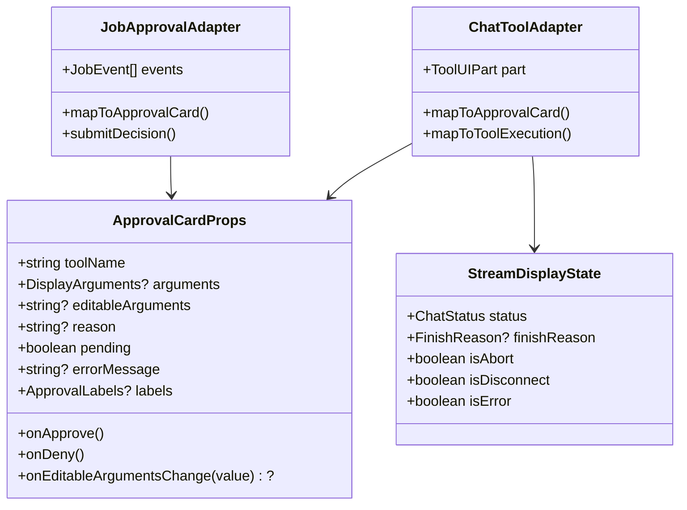
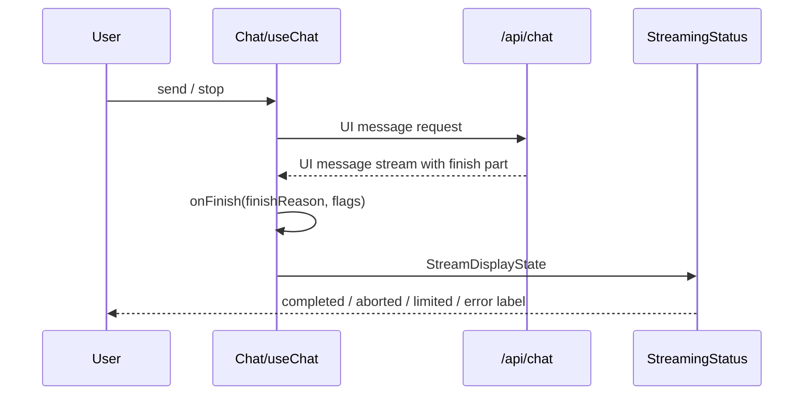

# 009-agent-ui-and-beta-intake — Technical Plan

Translates approved requirements (WHAT) into architecture (HOW). No implementation code.

## Summary

本計画は、(1) Carbon と Tailwind の短い共存期間を設けた画面単位の UI 移行、(2) TypeScript 7 と codegen 用 TypeScript 6 の局所的な二層化、(3) Python beta lane の既存充足事項を証跡化し、外部トリガー成立後に `services/api` を Python 3.14 へ上げる変更、の 3 本を責任境界が独立した change lane として設計する。ただし実行順は憲章原則 10 に従って直列化し、前 lane の完了レビューと CRITICAL 解消前に次 lane を開始しない。UI 部品は表示専用の中立 contract とし、認証、承認判定、consume-once、監査、永続化の既存単一経路には変更を加えない。

実装順は R1 → R2 → R3 (`ApprovalPanel`) → R3 (chat) → R4 → R5 → R6 → R7 を直列にし、R7 は `pydantic-ai-sandbox` の検証記録を追加の entry condition とする。R5.6 の TS 6 撤去は上流トリガー成立後に最後の deferred phase として実行する。各 lane は TDD、実測、対象 gate、敵対的レビューを完了してから次へ進む。

## Architecture Overview

```mermaid
flowchart TD
  subgraph UI[Web UI migration lane]
    L[app/layout.tsx] --> C[Carbon global.scss]
    L --> T[Tailwind tailwind.css]
    J[features/jobs/ApprovalPanel] --> A[agent-ui/ApprovalCard]
    M[features/chat/MessageItem] --> A
    M --> X[agent-ui/ToolExecution]
    H[features/chat/Chat] --> S[agent-ui/StreamingStatus]
    A --> P[shadcn primitives]
    X --> P
    S --> P
  end

  subgraph Existing[Existing security and transport owners]
    J --> JR[/api/jobs/:id/approve]
    JR --> AP[lib/approvals.ts]
    AP --> DB[(job_step / audit_log)]
    M --> SDK[AI SDK addToolApprovalResponse]
  end

  subgraph TS[TypeScript compiler lane]
    ROOT[Root TS 7] --> WEB[apps/web + apps/worker + packages]
    SCHEMA[packages/schemas TS 6] --> GEN[openapi-typescript 7.13.0]
    GEN --> SNAP[Committed generated contracts]
  end

  subgraph PY[Python beta intake lane]
    API[services/api existing behavior] --> REPORT[python-beta-intake report]
    API --> DESC[Model-facing description tests]
    API --> INV[Model.request inventory test]
    TRIGGER[pydantic-ai-sandbox 3.14 evidence] --> PY314[services/api Python 3.14 PR]
  end
```

UI lane は screen feature が transport と状態を所有し、`components/agent-ui` が presentation のみを所有する。移行中は Carbon screen と shadcn screen を同一画面で混在させず、最後の Carbon screen を除去した時点で preflight、font、CSS budget、agent instructions、ADR をまとめて最終化する。

TypeScript lane は package manager の単一 lockfile を維持したまま compiler dependency の所有者だけを分ける。Python lane は hub 内の証跡を正本にし、sibling repository への報告 PR の URL と commit を検証可能な外部 deliverable として扱う。

## Components

設計 ID は `DES-1.<n>` とし、各コンポーネントの見出しで宣言する。要件 ID `REQ-###` と spec.md の番号の対応は [traceability.md](./traceability.md) の「ID mapping」にある。

### DES-1.1: TailwindFoundation

- **Responsibility**: Tailwind v4、shadcn/ui source layout、theme token、class composition の最小基盤を提供する。
- **Public interface**: `tailwind.css`; `components.json`; `cn(...inputs: ClassValue[]): string`; copied shadcn primitives (`Button`, `Card`, `Input`, `Textarea`, `Badge`, `Alert`)。
- **Owns**: CSS layer、共存期間の cascade layer 順序（Carbon を最も弱い `carbon` layer に入れる。Interfaces の「Cascade layer contract」）、`apps/web/src` の source detection、theme variables、system font stack、variant styling。
- **Does NOT own**: screen layout、agent state、approval policy、API 通信、Carbon screen の style。
- **Requirements**: 1.1, 1.2, 1.3, 1.4, 1.5, 1.6, 1.7, 2.5

### DES-1.2: ApprovalCard

- **Responsibility**: chat と jobs の双方から利用できる、承認対象の表示と typed user intent の通知を行う。
- **Public interface**: `ApprovalCardProps` は `toolName`, optional display arguments, optional editable JSON text, optional reason, pending state, denial/error text, `onApprove`, `onDeny`, optional `onEditableArgumentsChange`, optional `labels: { approve: string; deny: string }` を持つ。`labels` は既存画面の文言（chat は「承認」／「却下」、jobs は「承認」／「拒否」）を adapter から渡すためのもので、既存テストの `getByRole("button", { name })` を無変更で通す（R3.2・R3.3）。文言の統一は本 spec の対象外とする。props は `@vaz/schemas` の値型と AI SDK UI part から adapter が導出し、screen 固有 event union は受けない。
- **Owns**: accessible label、local presentation state、button disabled state、arguments の画面表示。
- **Does NOT own**: JSON の domain validation、`fetch`、`addToolApprovalResponse`、approval eligibility、authentication、consume-once、audit、persistence。
- **Requirements**: 2.1, 2.2, 2.3, 2.4, 2.5, 2.6, 3.2, 3.3

### DES-1.3: ToolExecution

- **Responsibility**: AI SDK tool part の call/result/error state を一貫した表示へ変換する。
- **Public interface**: tool name、state、optional output/error、optional approval slot を受ける typed props。chat adapter は `isToolUIPart()` / `getToolName()` の結果を渡す。
- **Owns**: tool state badge、result container、`toolOutput` compatibility hook、safe empty/error states。
- **Does NOT own**: tool execution、argument logging、approval response、citation validation、tool result persistence。
- **Requirements**: 2.1, 2.2, 2.3, 2.4, 2.6, 3.3

### DES-1.4: StreamingStatus

- **Responsibility**: submitted/streaming/completed/aborted/error と client-observable finish reason を live region で表示する。
- **Public interface**: `status`, optional `finishReason`, `isAbort`, `isDisconnect`, `isError`, optional error message。
- **Owns**: `aria-live` / `role="status"`、human-readable label、loading indicator。
- **Does NOT own**: server `RunStopReason`、telemetry、retry policy、stream cancellation implementation。
- **Requirements**: 2.1, 2.3, 2.6, 3.3

### DES-1.5: JobsApprovalAdapter

- **Responsibility**: `JobEvent` stream から pending step を抽出し、既存 approval route contract を `ApprovalCard` へ接続する。
- **Public interface**: existing `ApprovalPanelProps`; internal mapping from `step-start`/`completion`/`error` to neutral card props。
- **Owns**: pending-step selection、editable JSON draft、parse error、POST body construction、response error mapping。
- **Does NOT own**: server-side approval decision、job authorization、claim transaction、audit semantics、page routing。
- **Requirements**: 2.1, 2.2, 2.3, 3.1, 3.2, 3.4, 3.5

### DES-1.6: ChatAgentUIAdapter

- **Responsibility**: `useChat` state と `UIMessage` parts を shared agent-ui components へ写像し、既存 chat behavior を維持する。
- **Public interface**: existing `Chat`, `ChatComposer`, `MessageItem`; `useChat({ onFinish, sendAutomaticallyWhen, throttle })` integration。
- **Owns**: `finishReason` view state、message role layout、composer draft、stop/retry callbacks、tool approval callback mapping、follow-bottom behavior。
- **Does NOT own**: `/api/chat` schema、agent stop policy、tool approval signing、audit、RAG citation validation。
- **Requirements**: 2.1, 2.2, 2.3, 2.6, 3.1, 3.3, 3.4, 3.5

### DES-1.7: CarbonRetirement

- **Responsibility**: 最後の Carbon screen 移行後に Carbon/Sass/CDN font と一時規約を撤去し、Tailwind preflight と新 budget を最終化する。
- **Public interface**: dependency manifest、`tailwind.css` global entry、`.size-limit.json`、paired agent instructions、ADR status。
- **Owns**: dependency removal、preflight enablement、system font token、measured CSS limit + headroom、migration completion record。
- **Does NOT own**: UI behavior change、new screen、brand redesign、new runtime dependency。
- **Requirements**: 4.1, 4.2, 4.3, 4.4

### DES-1.8: TypeScriptCompilerPartition

- **Responsibility**: root workspace を stable TypeScript 7 で検査しつつ、OpenAPI codegen を `@vaz/schemas` の TypeScript 6 toolchain に隔離する。
- **Public interface**: root `typescript` devDependency; `@vaz/schemas` devDependencies; `mise run openapi:gen` filtered invocation; Dependabot entries。
- **Owns**: compiler version ownership、codegen command resolution、generated output byte-identity gate、hold/removal comments、TS 7 採用 ADR（`docs/adr/0009-typescript-7-adoption.md`）と、それを根拠にした憲章 Additional Constraints / Deferred（TODO(TYPESCRIPT_MAJOR)）の MINOR 改正。ADR と改正案は依存変更より先に作り、人間レビューと承認記録を経てから適用する（tasks 5.1）。上流の TS 7 対応後は deferred task が schemas の TS 6 と hold を撤去する。
- **Dependabot hold design**: npm entry は `directory: "/"` の 1 つで pnpm workspace 全体を扱い、`ignore` は dependency 名単位でしか効かない（package 単位の指定や `/packages/schemas` 専用 entry は、同一 lockfile への重複 PR を生む）。そこで `typescript` の ignore を `versions: [">=7"]` から `update-types: ["version-update:semver-major"]` に置き換える。これで `packages/schemas` の 6→7 とルートの 7→8 は止まり、ルートの 7.x minor/patch と `packages/schemas` の 6.x patch は届く。6→7・7→8 は 0.x 系ではないので、`services/api` block が記録する update-types の誤分類には当たらない。理由はコメントに残し、`tests/repo/dependabot.spec.ts` の `HELD_BACK` は「`typescript` は semver-major のみ ignore」を検査する形へ直す。spec R5.4 の「Dependabot の `ignore` で 6.x に留め」はこの方式で満たす。
- **Dependabot hold verification（原則 8）**: 上の設計は、1 つの npm entry に `typescript` が 2 つの版（ルート 7.x と schemas 6.0.3）で並ぶ状態で、Dependabot が manifest ごとの現行版を基準に major を判定する、という前提に立っている。この前提はまだ実測していない。誤った場合は 2 通りの壊れ方がある。schemas に 6→7 の PR が来る（目に見える）か、ルートの 7.x minor が来なくなる（黙って起きる。`.github/dependabot.yml` の docker block のコメントが記録する「ignore の設定ミスは PR が来なくなるだけで失敗しない」と同じ型）。そこで tasks 5.3 で、設定を変える前に `dependabot-cli` の dry-run を一時的な worktree で行う。その worktree ではルートを最新より古い 7.x に下げて、(i) ルートの 7.x minor/patch が提案されること、(ii) 同じ提案が `packages/schemas` の 6.0.3 を書き換えないこと、(iii) schemas の 6→7 が提案されないこと、の 3 点を観測し、結果を Implementation Notes に記録する。
- **Fallback hold**: dry-run で 3 点のどれかが満たされない場合、または dry-run を実行できない場合は、`typescript` を条件なしの `ignore`（`dependency-name: "typescript"` だけ）にして Dependabot の対象から外す。ルートの 7.x minor/patch は人が上げることにし、その確認を `docs/dependency-policy.md` §8 の定期確認の項目に加える。黙って版が古くなることを、明示した手動運用に置き換えるためである。この場合も schemas は 6.x に留まるので R5.4 を満たす。R5.6 で compiler が 1 つになったら、root major hold（`update-types: ["version-update:semver-major"]`）へ戻す。どちらを採ったかと根拠を ADR-0009 に書く。
- **Post-merge confirmation**: マージ後の最初の定期実行で、Dependabot の update log（Insights → Dependency graph → Dependabot）を見て、`typescript` の扱いが dry-run の観測どおりかを確認し、§5 の Implementation Notes に追記する。食い違えば Fallback hold へ移す修正 PR を出す。
- **Repo guard design**: 今の `HELD_BACK` は 1 つのループで、ルート `package.json` の範囲（`^<major>.`）と `versions: [">=<major+1>"]` を一緒に検査している。`typescript` と `@types/node` で ignore の形が変わるため、ループを次のように分ける。(a) `@types/node` は今の `versions` 形式の検査をそのまま残す（`heldMajor: 24`）。(b) `typescript` は専用のアサーションにする。ルートの範囲が `^7.`、`packages/schemas/package.json` の devDependency が `6.0.3` 系、npm entry の ignore が `update-types: ["version-update:semver-major"]` ちょうどで `versions` を持たないこと、の 3 点を検査する。(b) は両方の manifest を読めたことを先に検査してから比べ、空振りしないようにする。Fallback hold を採った場合、(b) の ignore の検査は「`typescript` の ignore が `dependency-name` だけで、`versions` も `update-types` も持たない」に変わる。ルートの範囲と schemas の版の検査は同じである。R5.6 の後回しタスクでは、(b) のうち schemas 側の検査だけを外し、ignore の検査を semver-major の形へ戻す。
- **Does NOT own**: generated contract semantics、Next/worker source refactor、TypeScript prerelease adoption、`@types/node` major。
- **Requirements**: 5.1, 5.2, 5.3, 5.4, 5.5, 5.6

### DES-1.9: PythonBetaIntakeEvidence

- **Responsibility**: L1-L4 の hub 現状を実測し、model-facing description と direct model call inventory を機械検証可能な証跡として残す。
- **Public interface**: `services/api/docs/python-beta-intake-2026-10.md`; unit tests that inspect model-facing schema and allowed direct `Model.request()` locations。
- **Owns**: status/error distinction table、citation fail-closed evidence、description audit、direct call inventory、sibling report checklist。
- **Does NOT own**: rate limiter redesign、citation behavior change、new tools、raw prompt/argument logging、sibling repository implementation。
- **Requirements**: 6.1, 6.2, 6.3, 6.4, 6.5

### DES-1.10: Python314Upgrade

- **Responsibility**: trigger evidence 成立後に `services/api` だけを Python 3.14 へ移行し、runtime/development/container/policy pins を同期する。
- **Public interface**: `.python-version`; Docker base tags; Ruff target; repo/dependency documentation; `mise run api:check` and `mise run api:audit` gates。
- **Owns**: services/api interpreter pin、warnings census、Docker image series、Dependabot docker split、documentation synchronization、憲章 Additional Constraints「ツールチェーン」の Python 記述の MINOR 改正（slowapi を理由とする文を削り、`services/api` 3.14 / `services/agent` 3.13 と書き分ける）。
- **Does NOT own**: `services/agent` Python version、Python 3.15、new dependency major、uv workspace consolidation。
- **Requirements**: 7.1, 7.2, 7.3, 7.4

### DES-1.11: RepositoryPolicyGuards

- **Responsibility**: UI dependency grouping、compiler split、Docker coverage、version policy が設定と文書で drift しないことを検証する。
- **Public interface**: Vitest repo tests over `.github/dependabot.yml`, manifests, agent instructions, Dockerfiles。
- **Owns**: non-vacuous configuration assertions and exact held-back major checks。
- **Does NOT own**: Dependabot service execution、package installation、runtime feature behavior。
- **Requirements**: 1.5, 1.6, 5.4, 5.6, 7.2, 7.4

## External Dependencies

憲章 原則 11 により、本 spec が追加・移動する第三者依存はこの表がすべてである。ここに無い依存を追加するときは、先にこの表を改訂する。版の方針の検証元は research.md「External dependencies」。

| Dependency | 置き場 | 種別 | Version policy | Purpose | 撤去・見直しの条件 |
|---|---|---|---|---|---|
| `tailwindcss` | `apps/web` devDependencies | 追加 | 安定版 4.x。`minimumReleaseAge`（24h）を満たす版 | ユーティリティ生成とテーマ変数 | — |
| `@tailwindcss/postcss` | `apps/web` devDependencies | 追加 | `tailwindcss` と同じ 4.x の版に揃える | Next / Turbopack の PostCSS 統合 | — |
| `radix-ui` | `apps/web` dependencies | 追加 | 安定版の caret。24h ルールを満たす版 | コピーした shadcn 部品が使う primitives | — |
| `class-variance-authority` | `apps/web` dependencies | 追加 | 安定版の caret。24h ルールを満たす版 | 型付きの variant | — |
| `clsx` | `apps/web` dependencies | 追加 | 安定版の caret。24h ルールを満たす版 | 条件付きの class 合成（`cn()`） | — |
| `tailwind-merge` | `apps/web` dependencies | 追加 | 安定版の caret。24h ルールを満たす版 | 衝突しない class 結合（`cn()`） | — |
| `lucide-react` | `apps/web` dependencies | 追加 | 24h ルールを満たす最新の安定版 | アイコン | — |
| `typescript`（ルート） | ルート devDependencies | 版上げ | 安定版 7.x。プレリリース版は入れない | ワークスペースのコンパイラ | 7→8 は semver-major の ignore で止める（新しすぎる版を選ばせないピン） |
| `typescript`（`@vaz/schemas`） | `packages/schemas` devDependencies | 移動 | 6.0.3 系 | `openapi-typescript` の compiler API 互換 | `openapi-typescript` が TS 7 対応版を出したら撤去（R5.6。新しすぎる版を選ばせないピン） |
| `openapi-typescript` | `packages/schemas` devDependencies | 移動 | 既存の 7.13.0。この変更では版を上げない | OpenAPI のコード生成 | — |
| `@carbon/react`・`@carbon/styles`（`apps/web`）、`sass`（ルート devDependencies） | `apps/web`・ルート | 撤去（R4.1） | — | — | 最後の Carbon 画面を移した後。`sass` は残る SCSS の利用者がいないことを確認してから |

`shadcn` の CLI（`pnpm dlx shadcn@<version>`）は実行時に取得するだけで、依存としては追加しない。`shadcn init` / `shadcn add` は、上の表にないパッケージ（Tailwind v4 の new-york 構成が入れる `tw-animate-css` など）を `package.json` に書き込むことがある。実行後に manifest の差分を表と照合し、表にない依存は取り除いて、それを使う import や `@import` も残さない。animation などのために表にない依存が必要になったら、先にこの表を改訂する（原則 11）。

install スクリプトを持つものは `pnpm ignored-builds` で確認し、`pnpm-workspace.yaml` の `allowBuilds` に判断を記録する（R1.5）。Python の依存、実行時サービス、DB、認証プロバイダは追加しない。uv workspace の構成も変えない。

## Data Model

本 spec は DB schema を変更しない。既存の `job`, `job_event`, `job_step`, `audit_log` と approval wire contract をそのまま使用する。新しい型は UI 表示 contract と dependency-policy contract だけである。



| Entity / value | Field | Type | Notes |
|---|---|---|---|
| `ApprovalCardProps` | `toolName` | `string` | human-readable tool/specialist name; policy input には使わない |
| `ApprovalCardProps` | `arguments` | display-safe structured value or preformatted text, optional | chat だけが通常提供する。logger/telemetry へ渡さない |
| `ApprovalCardProps` | `editableArguments` | `string`, optional | jobs adapter が所有する JSON draft。component は parse しない |
| `ApprovalCardProps` | callbacks | typed functions | caller が AI SDK または HTTP route へ接続する。`onApprove()` は引数を取らない。jobs adapter は自身が持つ `editableArguments` の下書きを読んで本文を組み立て、chat adapter は `approval.id` と `true` を `addToolApprovalResponse` へ渡す |
| `ApprovalCardProps` | `labels` | `{ approve: string; deny: string }`, optional | 既定は「承認」／「拒否」。chat adapter は deny に「却下」を渡す |
| `StreamDisplayState` | `finishReason` | AI SDK `FinishReason | undefined` | `onFinish` で取得し、server `RunStopReason` とは別 contract |
| Dependency policy | root compiler | stable `typescript@7.x` | workspace typecheck/build owner |
| Dependency policy | schemas compiler | `typescript@6.0.3` line | `openapi-typescript` compatibility pin; removal trigger あり |
| Dependency policy | Dependabot `typescript` ignore | `update-types: ["version-update:semver-major"]` | workspace 全体に効く。root 7.x minor は通し、schemas 6→7 と root 7→8 を止める |
| Python runtime policy | services/api series | `3.14` after trigger | `.python-version` が唯一の runtime pin |

既存の `ApprovalDecision` / `ApprovalRequest` は変更しない。shared UI props を `packages/schemas` に新しい wire schema として追加せず、既存 schema/SDK types から screen adapter が導出する。UI-only callbacks や JSX-facing state を leaf package に持ち込まないためである。

## Interfaces / Contracts

### CSS entry contract

```text
layout.tsx
  ├─ import "@/assets/styles/global.scss"   # coexistence only, Carbon screens
  └─ import "@/assets/styles/tailwind.css" # theme + utilities, then preflight after R4
```

共存中の `tailwind.css` は theme と utilities のみを import し、utilities import の `source("../..")` で `apps/web/src` に限定する。R4 完了時に preflight を base layer へ追加し、`global.scss` import を削除する。

**Cascade layer contract（共存期間）**: Carbon の reset（`@carbon/styles/scss/_reset.scss`）は cascade layer の外へ要素セレクタで出力される（`div`/`span`/`p` などに `padding: 0; border: 0`、`button`/`input`/`textarea` に `border-radius: 0`）。layer 外の規則は詳細度に関係なく layer 内の規則より優先されるため、そのままでは `@layer utilities` にある Tailwind の `p-*`・`border`・`rounded-*` が移行済みの部品で効かない（2026-10-03、`@carbon/styles` 1.116.0 の source で確認）。そこで次のように固定する。

- `global.scss` の先頭で layer の順序 `@layer carbon, theme, base, components, utilities;` を宣言する。`layout.tsx` は `global.scss` を先に読むので、この宣言が文書で最初の layer 宣言になり、`carbon` が最も弱い layer になる。
- Carbon の出力（reset / zone / fonts / type / grid / components）をすべて `@layer carbon { … }` の中へ入れる。第一候補は、`@use` で config だけを読み、CSS を出すモジュールを `@layer carbon` ブロックの中で `sass:meta` の `load-css()` で読む方式とする。Sass がこの形を受け付けない場合は、tasks 1.1 で別の包み方を実測してから選び、その結果を Implementation Notes に記録する。
- Carbon の画面は Tailwind の class を持たないため、`carbon` layer を最も弱くしても Carbon 画面の見た目は変わらない。Carbon の規則どうしの順序は layer の中で保たれる。
- `Chat.module.scss` などの CSS Modules は layer の外に残るが、class セレクタで画面に閉じており、その画面を移す PR で削除する（R3.4）。
- 検証は `apps/web/tests/e2e/css-cascade.spec.ts`（Playwright）で行う。(a) 構造の検査: `document.styleSheets` の中で Carbon の規則が `carbon` という名前の `CSSLayerBlockRule` の中にあり、layer の順序が `carbon` から始まること。(b) 振る舞いの検査: shadcn primitives が使う class の文字列を持つ要素を `/` に差し込み、計算済みの `padding`・`border-width`・`border-radius` が 0 でないこと。jsdom は cascade layer を計算しないので、単体テストでは代わりにならない。
- Carbon 撤去後（R4）は `carbon` layer の宣言を消し、(a) を「`carbon` layer が無く、preflight の base 規則がある」検査へ置き換える。

### Agent UI component contract

- components are client components only when browser state/events require it。
- `ApprovalCard` は side effect を callback に委譲する。
- chat adapter は `ToolUIPart` の `approval.id` と approved boolean を `addToolApprovalResponse` へ渡す。
- jobs adapter は既存 `ApprovalRequest` body を作り、route response status の意味を変えない。
- raw arguments は visual tree でのみ扱い、console/logger/telemetry/error tracking に渡さない。
- `ToolExecution` は既存 E2E compatibility のため result container に `toolOutput` token を持つ class を維持する。将来 semantic test id へ移す場合は locator change と同一 PR にする。

### Chat finish contract



`StreamingStatus` は server audit の `RunStopReason` を推測しない。`finishReason` が無い場合は callback flags と chat status だけを表示する。

### Approval HTTP contract

既存 `POST /api/jobs/[id]/approve` の request/response、400/404/409/429、existence hiding、consume-once、budget、audit、resume semantics は変更しない。`ApprovalPanel` の UI 差し替えは同じ request body を生成し、既存 tests を無変更で通す。

### TypeScript codegen contract

```text
mise run openapi:gen
  ├─ export services/agent OpenAPI JSON
  ├─ pnpm --filter @vaz/schemas exec openapi-typescript ...agent-service.ts
  ├─ export services/api OpenAPI + SSE schema
  └─ pnpm --filter @vaz/schemas exec openapi-typescript ...api-service.ts
```

- `@vaz/schemas` は source-only runtime package のままで、build step は追加しない。
- codegen CLI dependencies だけを devDependencies として所有する。
- command 後に `git diff --exit-code packages/schemas/src/generated` が成功しなければ TS 7 PR を止める。
- root compiler と schemas compiler の version policy を Dependabot と repo tests で別々に検証する。

### Python beta intake evidence contract

`services/api/docs/python-beta-intake-2026-10.md` は以下の表を正本として持つ。

1. LLM usage budget / timeout / HTTP rate limit の status・body・header の違い。
2. citation source、allowed ID set、dangling citation の 502 fail-closed path。
3. model-facing tool/output descriptions と developer comments の分離。
4. direct `Model.request()` inventory と各呼び出しの tool omission rationale。
5. sibling repo の `docs/hub-intake-2026-10.md` と `specs/014-hub-python-beta-lane/traceability.md` を更新する報告 PR の URL と sibling commit。PR 作成とリンク記録を完了条件とし、merge は sibling repository のレビュー責任とする。

### Python 3.14 trigger contract

R7 task は `pydantic-ai-sandbox` spec 014 Requirement 1 の evidence link が無ければ開始しない。トリガー確認後、まず憲章改訂案をレビューし、承認記録を git 追跡対象へ保存してから MINOR 改正を適用する。改正では `mise.toml` 固定という包括表現も修正し、`services/api/.python-version` をこの lane の source of truth とする。その後に pin test の RED、runtime/container/Ruff/Dependabot の変更、`uv sync`、full API gate、audit、warning census を同じ PR で同期する。

## File Structure Plan

Tasks may touch only the paths below. Generated contract files are intentionally absent because R5.3 requires them to remain byte-identical. Phase review records are an explicit create-only exception listed below.

| File | Create/Modify/Delete | Responsibility |
|------|----------------------|----------------|
| `apps/web/package.json` | Modify | Declare Tailwind/shadcn runtime and dev dependencies; remove Carbon dependencies after the final screen migration. |
| `package.json` | Modify | Move root compiler to stable TypeScript 7 and move codegen-only dependencies out (R5); remove the root `sass` devDependency after Carbon retirement (R4.1). |
| `pnpm-lock.yaml` | Modify | Record the audited UI dependency set and compiler partition in the single workspace lockfile. |
| `pnpm-workspace.yaml` | Modify if required by `pnpm ignored-builds` | Record explicit allow/deny decisions for any new lifecycle scripts; otherwise retain unchanged. |
| `biome.json` | Modify | Enable Tailwind directive parsing while preserving repository formatting/lint policy. |
| `apps/web/postcss.config.mjs` | Create | Register `@tailwindcss/postcss` for the web app. |
| `apps/web/components.json` | Create | Declare shadcn new-york source layout, aliases, CSS entry, and icon library. |
| `apps/web/src/assets/styles/tailwind.css` | Create/Modify | Hold Tailwind layers, scoped source detection, theme tokens, system font, and post-Carbon preflight. |
| `apps/web/src/assets/styles/global.scss` | Modify/Delete | UI-1: declare the layer order and wrap all Carbon output in `@layer carbon` (Cascade layer contract). Then remove screen-specific Carbon `@use` entries incrementally, and finally remove the Carbon/Sass/CDN entry entirely. |
| `apps/web/src/app/layout.tsx` | Modify | Load the Tailwind entry during coexistence and remove the Carbon entry after retirement. |
| `apps/web/next.config.ts` | Modify | Remove Carbon-only Sass deprecation configuration after Sass is no longer required. |
| `apps/web/src/lib/utils.ts` | Create | Export the typed `cn()` class merge helper. |
| `apps/web/src/components/ui/button.tsx` | Create | Provide the copied shadcn button primitive and variants. |
| `apps/web/src/components/ui/card.tsx` | Create | Provide the copied shadcn card primitive. |
| `apps/web/src/components/ui/input.tsx` | Create | Provide the copied shadcn text input primitive. |
| `apps/web/src/components/ui/textarea.tsx` | Create | Provide the copied shadcn textarea primitive. |
| `apps/web/src/components/ui/badge.tsx` | Create | Provide the copied shadcn badge/status primitive. |
| `apps/web/src/components/ui/alert.tsx` | Create | Provide the copied shadcn accessible alert/status primitive. |
| `apps/web/src/components/agent-ui/ApprovalCard.tsx` | Create | Render neutral approval details/actions without transport, policy, persistence, or audit logic. |
| `apps/web/src/components/agent-ui/ToolExecution.tsx` | Create | Render tool call/result/error states and preserve the `toolOutput` compatibility hook. |
| `apps/web/src/components/agent-ui/StreamingStatus.tsx` | Create | Render live stream status and client-observable finish/abort state. |
| `apps/web/src/features/jobs/ApprovalPanel.tsx` | Modify | Adapt `JobEvent` state and existing approval POST behavior to `ApprovalCard`. |
| `apps/web/src/features/chat/Chat.tsx` | Modify | Replace Carbon layout/loading/error components, capture `onFinish`, and compose shared agent UI. |
| `apps/web/src/features/chat/ChatComposer.tsx` | Modify | Replace Carbon form controls while preserving IME, focus, busy, send, and stop behavior. |
| `apps/web/src/features/chat/MessageItem.tsx` | Modify | Map AI SDK message/tool parts to `ApprovalCard` and `ToolExecution` without changing approval callbacks or citations. |
| `apps/web/src/features/chat/Chat.module.scss` | Delete | Remove the migrated chat screen's CSS Module in the same PR as its Tailwind conversion. |
| `apps/web/tests/ApprovalCard.spec.tsx` | Create | Verify optional arguments/editing/actions, accessibility, pending/error states, and no embedded side effects. |
| `apps/web/tests/ToolExecution.spec.tsx` | Create | Verify tool states, outputs, errors, and compatibility DOM hook. |
| `apps/web/tests/StreamingStatus.spec.tsx` | Create | Verify live-region semantics and finish/abort/error labels. |
| `apps/web/tests/ApprovalPanel.spec.tsx` | Preserve | Keep the approval request, JSON validation, denial, and error contract unchanged across presentation migration. |
| `apps/web/tests/Chat.spec.tsx` | Modify | Verify shared component mapping, `onFinish` state, existing tool approval, composer, streaming, retry, and citation behavior. |
| `apps/web/tests/e2e/a11y.spec.ts` | Modify (UI-3) | Add a model-free `approval-requested` route mock and axe scan while retaining the error-status test. |
| `apps/web/tests/e2e/fixtures/approval-requested-stream.ts` | Create (UI-3) | Build the mocked UI message stream response: SSE body of `data: <UIMessageChunk JSON>` lines (`start` → `tool-input-available` → `tool-approval-request` → `finish`) with the `x-vercel-ai-ui-message-stream: v1` header, chunk shapes taken from `node_modules/ai/docs/`. |
| `apps/web/tests/e2e/css-cascade.spec.ts` | Create (UI-1), Modify (UI-3, UI-4) | UI-1: assert Carbon sits in the weakest `carbon` layer and that primitive utilities keep non-zero padding/border/radius on `/`. UI-3: pin the computed styles (padding, border, border-radius, gap) of the mounted chat elements as the visual baseline. UI-4: replace the layer assertion with "no `carbon` layer, preflight present", keep the baseline unchanged, and change only the intended font-family expectation first. |
| `apps/web/tests/e2e/approval-resume.spec.ts` | Preserve | Remain an unchanged approval route/resume regression gate. |
| `apps/web/tests/e2e/hitl-approval.spec.ts` | Preserve | Remain an unchanged HITL route contract regression gate. |
| `apps/web/tests/e2e/locator-citation.spec.ts` | Preserve or Modify with explicit locator rationale | Protect citation/tool output rendering; locator changes must be in the chat migration PR. |
| `apps/web/tests/e2e/chat-anthropic.spec.ts` | Preserve or Modify with explicit locator rationale | Protect the assistant message container contract. |
| `apps/web/tests/e2e/chat-openai.spec.ts` | Preserve or Modify with explicit locator rationale | Protect the assistant message container contract. |
| `apps/web/tests/e2e/chat-ollama.spec.ts` | Preserve or Modify with explicit locator rationale | Protect the assistant message container contract. |
| `.size-limit.json` | Modify only after Carbon retirement | Lower the CSS limit with `ceil_0.1kB(measured + max(1.0 kB, measured × 10%))`; the result must remain below 22 kB. |
| `.github/dependabot.yml` | Modify | Add the UI group, localize the schemas TypeScript 6 hold, and split services/api Docker Python policy for 3.14. |
| `tests/repo/dependabot.spec.ts` | Modify | Assert UI grouping, the `typescript` semver-major-only ignore, cooldowns, Docker coverage, and 3.14/3.15 policy. |
| `packages/evals/package.json` | Modify only if its standalone `tsc` flags fail under TS 7 | Keep the evals typecheck equivalent under the new compiler. |
| `mise.toml` | Modify | Execute `openapi-typescript` through `@vaz/schemas` while retaining all existing gate entry points. |
| `packages/schemas/package.json` | Modify | Own `openapi-typescript` and the TypeScript 6 codegen compiler as dev dependencies without adding a build step. |
| `AGENTS.md` | Modify | Replace Carbon/TS6/Python3.13 rules with the post-migration shadcn, compiler partition, and services/api 3.14 rules at their respective completion points. |
| `CLAUDE.md` | Modify | Mirror the root agent instruction changes exactly as the required pair. |
| `docs/dependency-policy.md` | Modify | Record TS 7 adoption, schemas TS 6 removal trigger, and services/api Python 3.14 status. |
| `docs/adr/0008-ui-component-standard.md` | Modify | Mark the UI migration complete with the final UI gate-pass date and final consequences. |
| `docs/adr/0009-typescript-7-adoption.md` | Create (TS-7, first task) | Record the TypeScript 7 adoption decision, the codegen TS 6 partition, and its removal trigger; the constitution delegates the 7.x decision to `docs/adr/`. |
| `.sdd/memory/constitution.md` | Modify (TS-7 first task; and after the R7 trigger) | MINOR amendments: TS-7 replaces the "TypeScript は 6.x 継続" constraint and resolves TODO(TYPESCRIPT_MAJOR) citing ADR-0009; R7 rewrites the Python 3.13 toolchain constraint per lane and drops the obsolete slowapi rationale. Each amendment updates the SYNC IMPACT REPORT and 改訂履歴. |
| `services/api/docs/python-beta-intake-2026-10.md` | Create | Record L1-L4 evidence and the checklist for reporting results to the Python beta lane. |
| `../pydantic-ai-sandbox/docs/hub-intake-2026-10.md` | Modify through external sibling PR | Record the received L1-L4 hub results and status transitions. |
| `../pydantic-ai-sandbox/specs/014-hub-python-beta-lane/traceability.md` | Modify through external sibling PR | Link the hub evidence, sibling commit, and report PR for Requirement 4 intake status. |
| `services/api/app/api/v1/agent.py` | Modify only if 6.1 finds budget/timeout responses not distinct from the 429 rate limit | Give the stop response its own `code` and a non-429 status (research.md Q9 found them distinct; this row is the contingency). |
| `services/api/app/api/v1/_stream.py` | Modify only under the same 6.1 condition | Same as above for the SSE error event. |
| `services/api/tests/unit/api/v1/test_agent_endpoints.py` | Modify only under the same 6.1 condition | Add the failing test that distinguishes the budget/timeout response from the 429 rate limit before the fix. |
| `services/api/tests/unit/api/v1/test_stream_lifecycle.py` | Modify only under the same 6.1 condition | Same as above for the SSE error event. |
| `services/api/app/agents/chat_agent.py` | Modify | Keep `ChatOutput`'s model-facing description free of requirement/test commentary, moving developer notes to comments. |
| `services/api/app/agents/tools_mock.py` | Modify only if audit finds model-facing commentary | Keep registered tool descriptions and parameter descriptions model-facing only. |
| `services/api/tests/unit/agents/test_tools_mock.py` | Modify | Extend schema inspection to cover all registered tool descriptions and parameter schema text. |
| `services/api/tests/unit/agents/test_chat_output_description.py` | Create | Inspect the structured output schema/description seen by a model and reject developer-only markers. |
| `services/api/tests/unit/test_model_request_inventory.py` | Create | Assert that direct `Model.request()` calls remain limited to the documented health probe. |
| `services/api/.python-version` | Modify after trigger | Pin the services/api lane to Python 3.14. |
| `services/api/tests/unit/test_python_version_pin.py` | Modify after trigger | Change the expected interpreter series and retain runtime/pin consistency checks. |
| `services/api/Dockerfile` | Modify after trigger | Move both builder and runtime images to Python 3.14 slim. |
| `services/api/pyproject.toml` | Modify after trigger | Set Ruff target to Python 3.14 while preserving the declared dependency floor unless evidence requires a separate decision. |
| `services/api/AGENTS.md` | Modify after trigger | Document `.python-version` as the sole pin, 3.14 warning census, and 3.15 hold reason. |
| `services/api/CLAUDE.md` | Modify after trigger | Mirror the services/api Python policy and remove the stale `mise.toml` pin statement. |
| `README.md` | Modify (UI-4 and TS-7) | UI-4: replace the Carbon Design System row of the tech-stack table (R4.3). TS-7: change the language row from TypeScript 6 to 7 (R5.4). |
| `.sdd/steering/tech.md` | Modify (UI-4, TS-7, and after the R7 trigger) | UI-4: replace the Carbon coexistence note with the shadcn/ui rules alongside the `AGENTS.md`/`CLAUDE.md` pair (R4.3). TS-7: replace "TypeScript 6.x" in the declared-major list (R5.4). R7: record services/api on 3.14 while leaving services/agent on its separately governed series. |
| `tests/repo/container-toolchain-pins.spec.ts` | Preserve | Run as part of the R7 gate. Verified 2026-10-03: it pins only `apps/worker`'s Node/pnpm ARGs, not a Python series, so the 3.14 Dockerfile change needs no edit here. |
| `specs/009-agent-ui-and-beta-intake/reviews/*.md` | Create | Store immutable per-phase and constitution-amendment review/approval records; never overwrite an earlier round. |

## Error Handling & Edge Cases

- Tailwind foundation raises CSS above 22 kB → do not raise the limit; reduce theme/base output or split the migration differently before merging (1.4).
- Carbon's unlayered reset overrides Tailwind utilities on migrated parts (padding/border/radius collapse to 0) → put all Carbon output in the weakest `carbon` layer before any part ships; `css-cascade.spec.ts` must fail without the wrap (1.2, 1.7).
- enabling preflight in R4 shifts the layout of migrated chat elements → `css-cascade.spec.ts`'s computed-style baseline from UI-3 fails; fix the styles, not the baseline. Only the intended font-family change (Carbon's IBM Plex → system font) is updated, and first (4.1).
- `pnpm ignored-builds` reports a new lifecycle script → audit the package and record an explicit `allowBuilds` decision; no implicit approval (1.5).
- Carbon and shadcn appear in the same screen tree → fail the screen migration review and keep the PR unmerged until one implementation remains (1.7).
- chat approval part has no arguments → render the approval reason/tool name and actions without an empty arguments panel (2.1).
- jobs approval has editable text but no source arguments → show the existing specialist placeholder/draft; validate JSON in `ApprovalPanel`, not `ApprovalCard` (2.1, 2.2).
- user rejects a jobs step → omit edited arguments from the request exactly as today (3.2).
- invalid JSON is submitted for approval → keep the request client-side, display the existing validation error, and do not call fetch (3.2).
- approval route returns 400/404/409/429 → retain current user-visible mapping and never infer resource existence from 404/409 distinctions (3.2).
- AI SDK `finishReason` is undefined → display a generic completed state derived from status/flags; do not invent server `RunStopReason` (2.1).
- user calls stop → `isAbort` takes precedence over `finishReason` in the status label (2.1).
- stream disconnect/error occurs → preserve retry behavior and `role="status"`; no raw request/tool data in the error component or logs (2.4, 3.3).
- migrated DOM breaks citation or provider E2E locators → either preserve the documented compatibility hooks or replace them with semantic locators in the same PR with rationale (3.3).
- Carbon removal leaves Sass used elsewhere → do not remove `sass` until dependency and source scans prove no remaining SCSS consumer (4.1).
- final CSS measurement is lower than 22 kB → calculate the new limit as `ceil_0.1kB(measured + max(1.0 kB, measured × 10%))`; if that result is not below 22 kB, stop and revise the plan (4.2).
- `openapi:gen` changes generated files under the compiler split → stop R5, inspect compiler/codegen behavior, and do not accept generated drift as incidental (5.3).
- root TS 7 passes typecheck but build/E2E fails → R5 remains unmerged; do not loosen tests or combine compatibility fixes with unrelated feature work (5.5).
- Dependabot proposes `typescript` 6→7 for `packages/schemas` → the semver-major ignore is misconfigured; fix the ignore and its repo test rather than merging the PR (5.4).
- the `dependabot-cli` dry-run cannot run, or shows that root 7.x minor updates are not proposed or that the proposal also rewrites schemas' 6.0.3 → adopt the Fallback hold (unconditional `typescript` ignore plus a manual root-update check in `docs/dependency-policy.md` §8); never ship a hold whose silent-failure mode is unobserved (5.4).
- `@vaz/evals`'s standalone `tsc --noEmit --ignoreConfig ...` fails under TS 7 (the beta lane has no evals package, so this is unverified) → check it first in the TS-7 PR; if a flag is unsupported, adjust the script within the same PR or stop R5 and record the blocker (5.5).
- usage budget exceeds in non-streaming chat → preserve the existing non-429 stop response; timeout remains 504; HTTP rate limit alone uses 429 + `Retry-After` (6.1).
- dangling citation ID appears → preserve 502 `UPSTREAM_GROUNDING_FAILED`; never filter and continue (6.2).
- model-facing schema contains requirement IDs, test names, warning markers, or stub commentary → test fails and developer text moves to comments (6.3).
- new direct `Model.request()` is added → inventory test fails until the call is removed or this plan is amended with an explicit tool-schema rationale (6.4).
- sibling Python 3.14 evidence is absent → keep R7 pending; no local pin changes (7.1).
- Python 3.14 introduces warning-as-error, missing wheel, audit, or container failure → stop the upgrade and record the blocker; do not weaken the warning policy or adopt 3.15 (7.3, 7.4).

### Delivery sequence and gates

| Lane / PR | Entry condition | Required verification |
|---|---|---|
| UI-1 foundation + shared components | approved design/tasks | re-measure the pre-Tailwind CSS baseline, add foundation/primitives/components, then run the complete UI-1 CSS spike; focused component tests, `css-cascade.spec.ts` (Carbon in the weakest layer, non-vacuous against removing the wrap), `mise run check`, `mise run build`, `mise run size`; absolute Client CSS ≤ 22 kB |
| UI-2 `ApprovalPanel` | UI-1 merged | unchanged `ApprovalPanel.spec.tsx`, approval route tests/E2E, `mise run check`, build/size |
| UI-3 chat | UI-2 merged | chat unit tests, a11y mock, computed-style baseline in `css-cascade.spec.ts`, existing provider/citation/HITL E2E, check/build/size; PR body notes that chat approval now shows tool arguments (R2.1, a visible change) |
| UI-4 Carbon retirement | UI-3 merged and no Carbon imports（Branch B では UI-3 と同じ PR・同じフェーズで、レビューは 1 回） | dependency scan, ignored-builds, unchanged computed-style baseline after preflight, check/build/size/E2E, measured new CSS limit |
| TS-7 compiler PR | UI-4 review complete; beta evidence linked; ADR-0009 and the reviewed/approved constitution amendment land first in the same PR | `dependabot-cli` dry-run of the `typescript` hold (or the Fallback hold), `@vaz/evals` standalone typecheck under TS 7 first, then `openapi:gen`, generated diff clean, `mise run check`, build, size, E2E |
| Python intake | TS-7 review complete | focused API unit tests, `mise run api:check`, `mise run api:audit`, sibling report PR URL recorded |
| Python 3.14 | Python intake review complete; sibling trigger evidence linked; constitution amendment reviewed and approved before pin changes | 3.14 `uv sync`, warning census, `api:check`, `api:audit`, container/toolchain repo tests |
| Deferred schemas TS 6 retirement | Python 3.14 review complete and upstream TS 7-support trigger recorded | remove local TS 6/hold, unify codegen, byte-identity, check/build/size/E2E |

#### CSS budget during coexistence

2026-10-03 時点の Client CSS の余裕は **2.06 kB**（19.94 kB、research.md ADR-1）。この値は見込みの参考値で、判定には使わない。依存の更新でベースラインが動くため、UI-1 の最初のタスク（tasks.md 1.1）で Tailwind を入れる前に `mise run build && mise run size` を再測定してベースラインとして記録し、判定は常に Client CSS の絶対値（≤ 22 kB）で行う。共存期間に減る Carbon CSS はほとんどない。`ApprovalPanel` の `Button` / `InlineNotification` / `Tag` / `Tile` はすべて chat と共用で、`ApprovalPanel` だけが使う `@use` は `text-input` 1 行である。reset / type / grid / fonts は Carbon 撤去まで残る。一方、Tailwind の theme + utilities は、ベータレーンの 3.89 kB（preflight 込み）から見て 1.7〜2.9 kB と見込まれる。

| PR | 加わる CSS（見込み） | 減る CSS | 判定 |
|---|---|---|---|
| UI-1 | theme 変数 + primitives 6 種と agent-ui の utilities | なし | スパイクの実測で決める |
| UI-2 | `ApprovalPanel` の utilities（UI-1 と大半が重なる） | `text-input` のみ | UI-1 実測 + 小 |
| UI-3 | chat 固有の utilities | chat 専用の `@use`（`text-area` / `inline-loading` / `content` など）と `Chat.module.scss` | 減少見込み |
| UI-4 | preflight | Carbon 全体（reset / type / grid / fonts / 残りの components） | 大幅減 |

**CSS spike (UI-1 の最終タスク)**: `tailwind.css`（theme + utilities、`source("../..")`）、primitives 6 種、agent-ui 3 部品をすべて入れ、各 component test を通した完成形で `mise run build && mise run size` を実行し、結果を PR 本文に残す。

スパイクは UI-1 の内容をすべて含む。したがって、スパイクの Client CSS が 22 kB を超えた時点で UI-1 だけで上限を超えており、後の PR の組み方では解消できない。分岐は次のとおり、判定する時点を分けて定める。

- **Branch A（スパイクの Client CSS ≤ 22 kB）**: 上の UI-1 → UI-2 → UI-3 → UI-4 の順で進める。22 kB を超えたら、theme 変数を agent-ui が実際に使うトークンだけに絞って再測定する。それで ≤ 22 kB になれば Branch A、超えたままなら Branch C とする。
- **Branch B（UI-3 で判定。UI-1・UI-2 は 22 kB 以内でマージ済み）**: chat の移行（UI-3）を、Carbon を残したまま入れると 22 kB を超える場合、UI-3（chat）と UI-4（Carbon 撤去）を 1 PR にまとめる。chat は最後の Carbon 画面なので、R3.1（1 画面 1 PR）と R4.1（WHEN last migrated）のどちらとも矛盾しない。この場合 UI-3 と UI-4 は 1 つのフェーズとして扱い、敵対的レビューは PR 全体（§3 と §4 の和）に対して 1 回行う。レビュー記録は `reviews/ui3-ui4-r<n>.md` とし、§3 単独のレビューは行わない（中間状態はマージされず、レビューの対象にならないため）。
- **Branch C（theme 変数を絞った後でも、UI-1 か UI-2 の時点で 22 kB を超える）**: 実装を止め、実測値を添えて本 plan を改訂する（R1.4「移行の順序か範囲を見直す」）。部品の追加を UI-3/4 まで遅らせる案は採らない。UI-2 は `ApprovalCard` を必要とし、R3.1 の移行順序が崩れるためである。

どの分岐でも R1.4 の上限は引き上げない。UI-1 の Branch A / C は tasks.md 1.7、UI-2 で初めて発生する Branch C は tasks.md 2.2、Branch B は tasks.md 3.3 で判定し、それぞれのフェーズの Implementation Notes に記録する。

Each completed implementation phase requires a fresh-context adversarial review before the next phase starts.

## Constitution Compliance

| Principle | Status | Notes |
|-----------|--------|-------|
| 1. Multi-agent changes require token-value justification | ✅ | No runtime multi-agent topology is added; existing chat/worker/Python boundaries remain. |
| 2. Fix layer boundaries with types | ✅ | Neutral UI props, SDK/schema-derived adapters, strict existing approval wire contracts, and Python typed tests preserve validated boundaries. |
| 3. Defend probabilistic behavior in four layers | ✅ | The plan changes presentation only; citation fail-closed, approval policy, tool guardrails, and deterministic tests remain separate. |
| 4. Observability from the start | ✅ | Existing OTel/audit paths are preserved; new UI emits no raw args to logs/telemetry. No new runtime execution path needs a new span contract. |
| 5. Converge on the single existing path | ✅ | `recordApprovalDecisions`, approval route, AI SDK callback, citation validation, and codegen task remain the only owners. |
| 6. Treat context as finite | ✅ | No tools or prompts are added. Model-facing descriptions are shortened by moving developer notes out of docstrings. |
| 7. Calibrate autonomy and preserve auditability | ✅ | Client components cannot decide approval eligibility or add approval flags; consume-once and audit remain server-owned. |
| 8. Establish facts by measurement | ✅ | Current bundle baseline was measured; SDK signatures and Pydantic schemas were inspected; dependency/runtime changes have explicit execution gates. Two unmeasured premises are made measurement gates rather than assumed: the Carbon/Tailwind cascade (`css-cascade.spec.ts`, tasks 1.1/1.7) and the two-version Dependabot `typescript` hold (`dependabot-cli` dry-run with a Fallback hold, task 5.3). |
| 9. Tests before implementation | ✅ | Each component/policy change has a named failing test boundary and Red-Green order in the delivery sequence. |
| 10. Do not skip staged gates | ✅ | UI → TS-7 → Python intake → Python 3.14 → deferred TS-6 retirement is serial. R7 and the deferred retirement also have external entry conditions. Each phase requires a fresh-context adversarial review recorded under `specs/009-agent-ui-and-beta-intake/reviews/` (git-tracked). Requirements, design, and tasks are each approved by an explicit human action recorded in `spec.json` `approvals`; bulk auto-approval (`-y`) does not count. |
| 11. Follow declared dependencies and versions | ✅ | Every added, moved, or removed dependency is declared in **External Dependencies**, with its version policy and removal condition; both TypeScript pins are recorded as "too-new" pins. No model ID or uv workspace change is introduced. |
| Privacy and logging constraints | ✅ | Raw prompt/tool args/tool output remain prohibited in normal logs; approval arguments are display-only and existing Audit ownership is unchanged. |
| Additional Constraints: toolchain pins (TypeScript 6.x, Python 3.13) | ✅ (by amendment) | R5 and R7 contradict the current text, so each lane first drafts, reviews, and records human approval for its constitution amendment in the same PR: TS-7 through ADR-0009, R7 by rewriting both the Python series and the overly broad `mise.toml` source-of-truth sentence. Neither lane changes a version before the approved amendment. |
| CI / workflow security | ✅ | No workflow action is added or repinned; existing SHA/permissions rules are unaffected. |

No CRITICAL constitution violation remains after the serialized dependencies and amendment-before-version gates defined here are applied. The TypeScript 6.x and Python 3.13 toolchain constraints in Additional Constraints are resolved by the amendments above (tasks 5.1 and 7.2). The Dependabot hold is resolved by design (semver-major ignore on the single workspace entry; see TypeScriptCompilerPartition). The remaining conditional risks are the coexistence CSS budget (resolved by the UI-1 spike and Branch B), the Carbon/Tailwind cascade (resolved by the `carbon` layer and `css-cascade.spec.ts`), the Dependabot behaviour with two `typescript` versions (resolved by the dry-run or the Fallback hold), and the unverified `@vaz/evals` standalone typecheck under TS 7 (checked first in the TS-7 PR).

## Requirements Traceability

| Requirement ID | Component(s) / verification |
|----------------|-----------------------------|
| 1.1 | TailwindFoundation; web manifest, PostCSS, shadcn config, copied primitives |
| 1.2 | TailwindFoundation; split CSS entries without preflight until Carbon retirement |
| 1.3 | TailwindFoundation; utilities `source("../..")` restricted to `apps/web/src` |
| 1.4 | TailwindFoundation, CarbonRetirement; build/size baseline and ≤22 kB coexistence gate |
| 1.5 | TailwindFoundation, RepositoryPolicyGuards; `pnpm ignored-builds` and `allowBuilds` audit |
| 1.6 | RepositoryPolicyGuards; UI dependency group and repo test |
| 1.7 | TailwindFoundation, JobsApprovalAdapter, ChatAgentUIAdapter; screen-serial migration |
| 2.1 | ApprovalCard, ToolExecution, StreamingStatus, both adapters |
| 2.2 | ApprovalCard and adapters; side effects remain in existing screen/route/lib owners |
| 2.3 | ApprovalCard, ToolExecution, StreamingStatus; typed SDK/schema-derived props |
| 2.4 | all agent-ui components; display-only args and privacy tests/review |
| 2.5 | TailwindFoundation and agent-ui source directories; hub-owned copyable source/token contract |
| 2.6 | three component unit tests plus chat approval a11y route mock |
| 3.1 | delivery sequence UI-2 then UI-3; one screen per PR |
| 3.2 | JobsApprovalAdapter; unchanged ApprovalPanel and approval route/E2E contracts |
| 3.3 | ChatAgentUIAdapter and ToolExecution; approval/citation behavior and DOM compatibility gates |
| 3.4 | JobsApprovalAdapter, ChatAgentUIAdapter, CarbonRetirement; same-PR SCSS/@use removal |
| 3.5 | each UI PR records before/after `mise run size` measurements |
| 4.1 | CarbonRetirement; dependency/SCSS/Sass/CDN removal and preflight activation |
| 4.2 | CarbonRetirement; deterministic measured CSS limit formula (`+ max(1.0 kB, 10%)`, rounded to 0.1 kB) |
| 4.3 | CarbonRetirement; paired `AGENTS.md` / `CLAUDE.md` rule replacement, plus `.sdd/steering/tech.md` and the `README.md` tech-stack row |
| 4.4 | CarbonRetirement; ADR-0008 completion status and final UI gate-pass date |
| 5.1 | TypeScriptCompilerPartition; single isolated PR linked to beta evidence; ADR-0009 and constitution amendment first |
| 5.2 | TypeScriptCompilerPartition; dependencies move to schemas and filtered mise command |
| 5.3 | TypeScriptCompilerPartition; generated directory byte-identity gate |
| 5.4 | TypeScriptCompilerPartition, RepositoryPolicyGuards; root TS 7 and local TS 6 hold; `.sdd/steering/tech.md` and the `README.md` language row |
| 5.5 | TypeScriptCompilerPartition; check/build/size/E2E gate |
| 5.6 | TypeScriptCompilerPartition; deferred compiler unification, schemas-specific hold cleanup, root 7→8 major hold retention, and full gates |
| 6.1 | PythonBetaIntakeEvidence; budget/timeout/rate-limit distinction table and tests |
| 6.2 | PythonBetaIntakeEvidence; citation source/validation/502 evidence |
| 6.3 | PythonBetaIntakeEvidence; tool and output description schema tests |
| 6.4 | PythonBetaIntakeEvidence; direct `Model.request()` inventory test/documentation |
| 6.5 | PythonBetaIntakeEvidence; sibling report PR creation plus recorded PR URL and commit |
| 7.1 | Python314Upgrade; external evidence entry condition |
| 7.2 | Python314Upgrade, RepositoryPolicyGuards; synchronized pin/Docker/Ruff/docs/Dependabot files and the constitution toolchain amendment |
| 7.3 | Python314Upgrade; 3.14 api gate and audit |
| 7.4 | Python314Upgrade, RepositoryPolicyGuards; explicit 3.15 exclusion and wheel blocker record |
